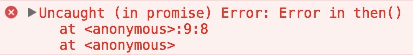
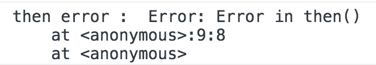

> ⚠️ 해당 글의 내용과 예시 코드, 이미지는 모두 참고 자료에서 가져 와 정리 한 것입니다.

[지난 글](/js-event-loop)에서 짧게 이야기 했던 비동기 처리에 대해 좀 더 자세히 이야기 해보도록 하겠습니다.

우선 비동기 처리에 대해서 한번 더 이야기 하고 가도록 하겠습니다.

자바스크립트는 싱글 스레드 기반의 프로그래밍 언어로 한번에 한가지 일만 할 수 있습니다.

때문에 한가지 일이 진행되는 동안 프로그램은 블록킹 상태가 되게 됩니다.

이 문제점을 해결하기 위한 방법은 무엇이 있을까요?

그 방법으로는 **지금** 실행 할 수 없는 작업은 **나중에** 실행하는 방법이 있습니다.

이 말은 **지금 완료 할 수 없는 작업**을 **비동기 적**으로 수행한다는 이야기입니다.

# 비동기 처리

---

아래 예시 코드를 보도록 하겠습니다.

```jsx
// ajax(..) is some arbitrary Ajax function given by a library
var response = ajax('<https://example.com/api>');

console.log(response);
// `response` won't have the response
```

우리는 response 변수의 출력을 원하는 시점에 원하는 값이 아직 할당 되지 않았음을 알고 있습니다.

이 말은 **Ajax 함수가 실행된 시점**에는 아직 response 에 할당 할 **반환 값이 없다**는 이야기입니다.

이 말은 Ajax 함수가 **비동기 적**으로 수행된다는 이야기 입니다.

아래 예시 코드와 같이 Ajax 함수를 **동기 적**으로 수행 할 수 있는 방법도 있습니다.

```jsx
// This is assuming that you're using jQuery
jQuery.ajax({
    url: '<https://api.example.com/endpoint>',
    success: function(response) {
        // This is your callback.
    },
    async: false // And this is a terrible idea
});
```

하지만 이 방법을 사용 할 시 Ajax 요청에 응답이 올 때 까지 브라우저는 **동작을 멈춰 버릴 것**입니다.

이는 사용자 경험을 최악으로 떨어뜨리는 **매우 안좋은 방법**입니다.

그렇다면 비동기 함수가 결과를 반환 하기를 **기다릴 수 있는 방법**은 무엇이 있을까요?

# 콜백 함수

---

우선 가장 간단한 방법은 아래 예시 코드와 같이 **콜백 함수**를 이용하는 것입니다.

```jsx
ajax('<https://example.com/api>', function(response) {
    console.log(response); // `response` is now available
});
```

Ajax 함수는 요청에 **응답이 오면** 두번째 인자로 넘겨진 **콜백 함수**를 **호출** 할 것입니다.

위 같은 방법을 **콜백 함수를 이용한 비동기 처리**라고 합니다.

위처럼 비동기 콜백 함수를 이용해 비동기 처리를 하는 방법은 자바스크립트 비동기 처리의 가장 근본적인 부분이라고 할 수 있습니다.

하지만 콜백 함수를 이용한 비동기 처리에는 몇가지 문제점이 있습니다.

# 콜백 함수를 이용한 비동기 처리의 문제점

---

아래 예시 코드를 보도록 하겠습니다.

```jsx
listen('click', function (e){
    setTimeout(function(){
        ajax('<https://api.example.com/endpoint>', function (text){
            if (text == "hello") {
				        doSomething();
				    }
				    else if (text == "world") {
				        doSomethingElse();
            }
        });
    }, 500);
});
```

3개의 **콜백 함수**가 **중첩**되어 있는 것을 보실 수 있습니다.

이런 식의 중첩이 반복되는 코드를 **콜백 지옥** 이라고 부르기도 합니다.

**콜백 지옥** 코드는 **가독성**이 떨어지고 **로직**을 변경 하기가 점점 **어려워** 집니다.

아래와 같이 **코딩 패턴** 만을 이용해서도 **콜백 지옥의 문제점**을 **조금은** 개선 할 수 있습니다.

```jsx
function onClick = function() {
		setTimeout(getEndpoint, 500);
}

function getEndpoint = function() {
		ajax('<https://api.example.com/endpoint>', doFunction);
}

function doFunction = function(text) {
		if (text == "hello") {
				doSomething();
	  }
	  else if (text == "world") {
	      doSomethingElse();
    }
}

listen('click', onClick);
```

앞의 **콜백 지옥** 예시 코드에서 **중첩** 되어 선언 되어 있던 **익명 함수**들을 **각각의 함수**로 구분하여 코드를 **정리**하여 중첩과 들여 쓰기가 줄어들어 **가독성**이 **조금** 더 높아졌습니다.

하지만 콜백 지옥은 **단순히 중첩이나 들여쓰기 만의 문제는 아닙니다**.

위 예시 코드를 자연스러운 순서대로 배치하면 아래와 같을 것입니다.

1. `listen('click', fn)`
2. `setTimeout(fn, 500)`
3. `ajax('<https://api.example.com/endpoint>', fn)`
4. `if (text == "hello") { ... } else if (text == "world") { ... }`

이렇게 코드를 **위에서부터 순서대로 읽는 것**이 훨씬 **자연스러워** 보입니다.

그렇다면 위 처럼 코드를 **자연스러운 순서대로** 작성 할 수 있다면 좋지 않을까요?

# 프로미스

---

**프로미스**(Promise) 는 비동기 처리를 **콜백 함수**를 이용한 방식보다 **쉽고 강력하게** 사용 할 수 있는 도구입니다.

**프로미스**는 최종 결과를 반환하는 것이 아니라 **프로미스를 반환** 해 **미래의 어떤 시점에 결과를 제공**합니다.

프로미스는 다음 **세가지 중 하나의 상태**를 가집니다.

- **대기**(_pending)_: 이행하거나 거부되지 않은 초기 상태.
- **이행**(_fulfilled)_: 연산이 성공적으로 완료됨.
- **거부**(_rejected)_: 연산이 실패함.

# 대기(pending)

---

우선 프로미스를 사용하려면 아래와 같이 **프로미스 객체**를 생성해야 합니다.

```jsx
new Promise(executor)
```

**프로미스 객체**는 **new** 키워드를 이용해 **생성자**를 사용해 생성합니다.

그렇게 생성 된 프로미스는 **대기 상태**가 됩니다.

그리고 프로미스 객체의 **then 함수**를 사용해 프로미스의 **상태 별 처리기**를 추가 할 수 있습니다.

then 함수의 **첫번째 인자**로는 프로미스의 **이행 처리기**를 받고,

**두번째 인자**로는 프로미스의 **거부 처리기**를 받습니다.

또한 then 함수는 **호출 된 처리기의 반환값** 또는 프로미스가 **처리되지 않은 경우 그 원래 처리된(settled) 값**으로 결정하는 **새 프로미스를 반환**합니다.

아래 예시 코드를 보도록 하겠습니다.

```jsx
new Promise(executor).then(
  handleSuccess,
  handleError
);
```

만약 생성 한 프로미스가 **이행된다면** then 함수의 **첫번째 인자로 넘겨진 이행 처리기**가 호출 될 것이고 **거부된다면** **두번째 인자로 넘겨진 거부 처리기**가 호출 될 것입니다.

그럼 **프로미스 상태**를 **이행**이나 **거부 상태**로 만들기 위해선 어떻게 해야 할까요?

# **이행**(fulfilled)/**거부**(rejected)

---

바로 프로미스 객체를 생성할 때 **생성자의 인자**로 받는 **실행 함수**를 이용해 프로미스의 상태를 변경 할 수 있습니다.

프로미스의 **실행 함수**는 **resolve** 함수와 **reject** 함수를 인자로 제공받아 즉시 실행됩니다.

그중 **resolve 함수**는 **호출 할 때 주어지는 값으로 프로미스를 이행**합니다.

**reject 함수**는 **호출 할 때 주어지는 이유로 프로미스를 거부**합니다.

실행 함수는 보통 어떠한 비동기 작업을 시작하고 **모든 작업을 끝내면 resolve 함수를 호출해 프로미스를 이행**하고 만약 **오류가 발생 할 경우 reject 함수를 호출 해 프로미스를 거부**합니다.

또한 **실행 함수에서 오류가 발생 할 경우 프로미스는 거부** 됩니다.

이제 아래 예시 코드를 이해 할 수 있게 되었습니다.

```jsx
function getData() {
  return new Promise(function(resolve, reject) {
    $.get('url 주소/products/1', function(response) {
      if (response) {
        resolve(response);
      }
      reject(new Error("Request is failed"));
    });
  });
}

// 위 $.get() 호출 결과에 따라 'response' 또는 'Error' 출력
getData().then(function(data) {
  console.log(data); // response 값 출력
}, function(err) {
  console.error(err); // Error 출력
});
```

위 코드는 **새로운 프로미스 객체**를 생성하여 실행 함수에서 **ajax 를 이용해 데이터를 요청** 한 후 응답을 확인하여 **데이터가 있을 경우 프로미스를 이행**하고 **그렇지 않을 경우 프로미스를 거부**하도록 하였습니다.

그리고 **then 함수**를 이용해 **프로미스가 이행 될 경우 이행 처리기를 이용해 주어진 값을 출력**하고 **프로미스가 거부 될 경우 거부 처리기를 이용해 에러 내용을 출력**하도록 하였습니다.

이것이 **프로미스**의 **기본 내용**입니다.

그렇습니다. **프로미스를 사용하는 방법**은 **콜백 함수를 이용하는 방법**과 매우 **유사**합니다.

하지만 프로미스는 **또다른 여러가지 특징**을 가지고 있습니다.

# catch 함수

---

우선 프로미스에는 then 함수가 아니라 **catch 함수**를 이용해도 **거부 처리기**를 추가 할 수가 있습니다.

아래 예시 코드를 보도록 하겠습니다.

```jsx
function getData() {
  return new Promise(function(resolve, reject) {
    $.get('url 주소/products/1', function(response) {
      if (response) {
        resolve(response);
      }
      reject(new Error("Request is failed"));
    });
  });
}

// 위 $.get() 호출 결과에 따라 'response' 또는 'Error' 출력
getData().then(function(data) {
  console.log(data); // response 값 출력
}).catch(function(err) {
  console.error(err); // Error 출력
});
```

아까 위의 예시 코드에서 **then 함수를 사용해 거부 처리기를 추가 하던 것을 catch 함수를 이용하도록 변경** 하였습니다.

**then 함수**를 이용해서도 **거부 처리기를 추가 할 수 있는데** 굳이 **catch 함수를 사용해야 하는 이유**는 무엇 일까요?

**then 함수의 거부 처리기**는 프로미스의 실행 함수 내에서 발생 된 예외는 잡아 낼 수 있지만 **then 함수 내에서 발생 된 예외는 잡지를 못합니다**.

아래 예시 코드를 보도록 하겠습니다.

```jsx
// then()의 두 번째 인자로는 감지하지 못하는 오류
function getData() {
  return new Promise(function(resolve, reject) {
    resolve('hi');
  });
}

getData().then(function(result) {
  console.log(result);
  throw new Error("Error in then()"); // Uncaught (in promise) Error: Error in then()
}, function(err) {
  console.log('then error : ', err);
});
```

위 코드를 실행하면 아래와 같은 오류가 발생하게 됩니다.



하지만 아래 예시 코드처럼 **catch 함수**를 사용해서 거부 처리기를 추가한다면 **then 함수 내에서 발생한 예외**도 잡을 수 있게 됩니다.

```jsx
// catch()로 오류를 감지하는 코드
function getData() {
  return new Promise(function(resolve, reject) {
    resolve('hi');
  });
}

getData().then(function(result) {
  console.log(result); // hi
  throw new Error("Error in then()");
}).catch(function(err) {
  console.log('then error : ', err); // then error :  Error: Error in then()
});
```

위 코드의 처리 결과는 아래와 같습니다.



그렇기 때문에 **거부 처리기**는 **catch 함수를 사용해서 추가하는 것이 좋습니다**.

# 프로미스 체이닝

---

또한 프로미스는 여러개의 프로미스를 연결하는 **프로미스 체이닝**이 가능합니다.

그 이유는 아까 이야기 했듯이 **then 함수**가 **새로운 프로미스를 반환**하기 때문입니다.

아래 예시 코드를 보도록 하겠습니다.

```jsx
function fulfilledHandler(response) {
    return new Promise(function(resolve, reject) {
				var value = response + 1000
        setTimeout(function() {
            console.log(value)
            resolve(value)
        }, value)
    })
}

new Promise(function(resolve, reject) {
		var value = 0
    console.log(value) // 0
		resolve(value)
}).then(fulfilledHandler) // 1000
.then(fulfilledHandler) // 2000
.then(fulfilledHandler) // 3000
```

위 함수는 **새로운 프로미스 객체**를 만들어 **0 이라는 값을 출력**하고서 **해당 값으로 프로미스를 이행** 할 것입니다.

이후 **첫번째 then 함수의 이행 처리기**가 실행 돼 **1000ms 이후 1000 이라는 값을 출력하고 해당 값으로 프로미스를 이행하는 실행 함수를 가진 새로운 프로미스를 반환** 할 것입니다.

그렇게 반환 된 **새로운 프로미스**가 **이행**되면 **두번째 then 함수의 이행 처리기**가 마찬가지로 **2000ms 이후 2000 이라는 값을 출력하고 해당 값으로 프로미스를 이행하는 실행 함수를 가진 새로운 프로미스를 반환** 할 것입니다.

이후에도 마찬가지 일 것입니다.

이것은 **then 함수**가 **새로운 프로미스 객체를 반환 하기 때문**에 가능 한 점입니다.

(**catch 함수**도 마찬가지로 **새로운 프로미스 객체를 반환**합니다.)

이렇게 **프로미스**는 강력한 기능들을 제공하기 때문에 **콜백 함수**로 비동기 처리를 하는 것 보다는 **프로미스**를 이용하는 것이 좋겠습니다.

# async/await

---

위에서 이야기 하였듯이 우리는 코드를 **위에서부터 차례대로** 읽는 것이 자연스럽다고 느낍니다.

하지만 **프로미스**는 콜백 함수와 매우 유사하기 때문에 **이를 완벽하게 충족시켜 주지 못합니다**.

그래서 자바스크립트는 **ES8** 에서 프로미스 사용을 쉽게 도와주는 **async/await** 를 도입했습니다.

먼저 **async/await** 가 어떻게 동작 하는지 알아보도록 하겠습니다.

# async

---

아래는 **async 함수**를 정의하는 방법입니다.

```jsx
async function 함수명() {
  await 비동기_처리_함수_명();
}
```

우선 위 처럼 **기존 함수**의 앞에 **async** 라는 **예약어**를 붙이면 **비동기 함수**를 정의 할 수 있습니다.

이렇게 생성 된 **비동기 함수**는 [**AsyncFunction](https://developer.mozilla.org/en-US/docs/Web/JavaScript/Reference/Global_Objects/AsyncFunction) 객체를 반환**합니다.

**AsyncFunction 객체**는 해당 함수 내에 포함되어 있는 코드를 수행하는 **비동기 함수**를 나타냅니다.

이렇게 만들어진 **비동기 함수**가 **호출** 되면 이것은 **프로미스를 반환**합니다.

**비동기 함수**가 **프로미스가 아닌 값**을 반환하면, **프로미스는 자동으로 생성**되며 **해당함수로 부터 반환 받은 값을 가지고 프로미스를 이행**합니다.

아래 예시 코드를 보도록 하겠습니다.

```jsx
async function asyncFunction() {
		return 1
}
asyncFunction().then(function(response) {
		console.log(response) // 1
})
```

위 예시 코드 처럼 **비동기 함수**는 **프로미스를 반환**하게 됩니다.

# await

---

그리고 이렇게 만들어진 **비동기 함수**는 **await 구문**을 포함할 수 있습니다.

**await 구문**을 이용하면 **함수의 수행을 멈추고 await 구문으로 넘긴 프로미스의 이행 값이 넘어 오기를 기다립니다**.

그리고 **프로미스가 이행되면 이행 된 값을 반환**합니다.

> 이것은 프로그램이 _**블록킹 된다는 뜻이 아닙니다.**_

**실제로 함수의 실행이 중단되는 것이 아니라** await 구문이 **남은 코드를 보이지 않는 then 함수에 담아 둔 것**입니다.

**await 구문의 실행 방식**은 함수를 **프로미스 체인**으로 작성하는 것과 같다고 보면 됩니다.

> _async/await의 목적은 **프로미스의 이용을 쉽게 하는 것**입니다._

아래 예시 코드를 보겠습니다.

```jsx
function fetchUser() {
  var url = '<https://jsonplaceholder.typicode.com/users/1>'
  return fetch(url).then(function(response) {
    return response.json();
  });
}

function fetchTodo(userId) {
  var url = `https://jsonplaceholder.typicode.com/todos/${userId}`;
  return fetch(url).then(function(response) {
    return response.json();
  });
}

async function logTodoTitle() {
  var user = await fetchUser();
  var todo = await fetchTodo(user.id);
  console.log(todo.title); // delectus aut autem
}
```

위 처럼 **async/await** 는 **여러 개의 비동기 처리**를 다룰 때 빛을 발합니다.

**fetchUser 함수**는 **유저의 정보를 가져오는 프로미스 객체**를 반환합니다.

**fetchTodo 함수**는 **유저 아이디를 가지고 할 일 정보를 가져오는 프로미스 객체**를 반환합니다.

**logTodoTitle 함수**는 **비동기 함수**이기 때문에 **await 구문**을 이용 할 수 있습니다.

해당 함수는 **fetchUser 함수가 반환한 프로미스**가 유저 정보를 가져오도록 하고 **응답이 올 때까지 수행을 멈춥니다.**

그리고 **유저 정보가 넘어오면** 해당 유저 정보에서 유저의 id 값을 이용해 **fetchTodo 함수가 반환한 프로미스**를 이용해 할 일 정보를 가져오도록 하고 **응답이 올 때까지 또 수행을 멈춥니다.**

그리고 **할 일 정보가 넘어오면** 할 일 정보의 제목을 출력합니다.

물론 위에서 말했다시피 await 구문에서 **실제로 함수가 수행을 멈추는 것은 아닙니다.**

아마 **logTodoTitle 함수**는 아래 코드와 유사하게 동작 할 것입니다.

```jsx
function logTodoTitle() {
	fetchUser().then(function(response) {
		var user = response
		fetchTodo(user.id).then(function(response) {
			var todo = response
			console.log(todo.title); // delectus aut autem
		})
	})
}
```

다시 한번 이야기 하지만 **async/await** 는 이런 **프로미스의 사용을 쉽게 도와주는 역할**을 할 뿐입니다.

# async/await 예외 처리

---

마지막으로 async/await 의 **예외 처리**에 대해 알아보도록 하겠습니다.

async/await 의 예외 처리는 **try catch 문**을 이용하면 됩니다.

아래 예시 코드를 보도록 하겠습니다.

```jsx
async function logTodoTitle() {
  try {
    var user = await fetchUser();
    if (user.id === 1) {
      var todo = await fetchTodo();
      console.log(todo.title); // delectus aut autem
    }
  } catch (error) {
    console.log(error);
  }
}
```

이렇게 하면 **네트워크 통신 오류** 뿐만 아니라 간단한 타입 오류 등의 **일반적인 오류** 까지도 **catch**로 잡아낼 수 있습니다.

위 내용들 과는 별개로 제가 정말 감명 깊게 보았던 **비동기 프로그래밍에서의 에러 핸들링**에 관한 영상이 있어 아래에 추가합니다.

[유인동 - ES6+ 비동기 프로그래밍과 실전 에러 핸들링](https://www.youtube.com/watch?v=o9JnT4sneAQ)

위 영상에 대해서는 다음에 따로 분석하여 이해해 보는 글을 작성해 보도록 하겠습니다.

## 참고 자료

---

- [자바스크립트는 어떻게 작동하는가: 이벤트 루프와 비동기 프로그래밍의 부상, async/await을 이용한 코딩 팁 다섯 가지](https://engineering.huiseoul.com/%EC%9E%90%EB%B0%94%EC%8A%A4%ED%81%AC%EB%A6%BD%ED%8A%B8%EB%8A%94-%EC%96%B4%EB%96%BB%EA%B2%8C-%EC%9E%91%EB%8F%99%ED%95%98%EB%8A%94%EA%B0%80-%EC%9D%B4%EB%B2%A4%ED%8A%B8-%EB%A3%A8%ED%94%84%EC%99%80-%EB%B9%84%EB%8F%99%EA%B8%B0-%ED%94%84%EB%A1%9C%EA%B7%B8%EB%9E%98%EB%B0%8D%EC%9D%98-%EB%B6%80%EC%83%81-async-await%EC%9D%84-%EC%9D%B4%EC%9A%A9%ED%95%9C-%EC%BD%94%EB%94%A9-%ED%8C%81-%EB%8B%A4%EC%84%AF-%EA%B0%80%EC%A7%80-df65ffb4e7e)
- [자바스크립트 비동기 처리와 콜백 함수](https://joshua1988.github.io/web-development/javascript/javascript-asynchronous-operation/#%EB%93%A4%EC%96%B4%EA%B0%80%EB%A9%B0)
- [자바스크립트 Promise 쉽게 이해하기](https://joshua1988.github.io/web-development/javascript/promise-for-beginners/)
- [자바스크립트 async와 await](https://joshua1988.github.io/web-development/javascript/js-async-await/)
- [[Node.js] await은 정말 Non-Blocking일까?](https://yorr.tistory.com/20)
- [Promise](https://developer.mozilla.org/ko/docs/Web/JavaScript/Reference/Global_Objects/Promise)
- [Promise() 생성자](https://developer.mozilla.org/ko/docs/Web/JavaScript/Reference/Global_Objects/Promise/Promise)