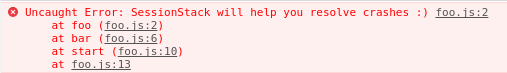
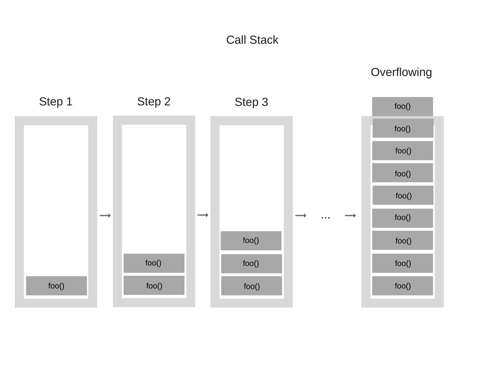
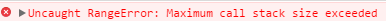
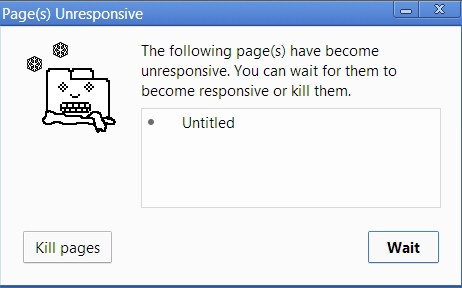
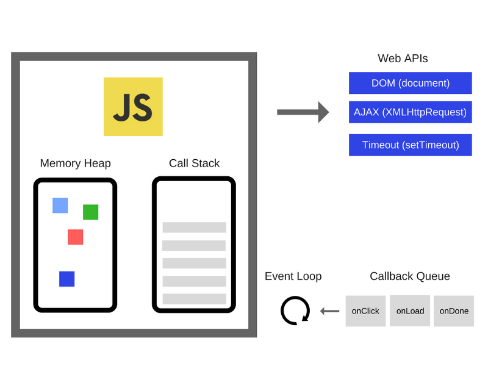

자바스크립트는 싱글 스레드 기반의 프로그래밍 언어로 한번에 하나의 일만 처리 할 수 있습니다.

이것은 **콜 스택**이 **하나**라는 뜻인데요.

**콜 스택**이 무엇인지 알아보기 위해 **자바스크립트 구조**에 대해 간단히 알아 볼 필요가 있습니다.

> ⚠️ 해당 글의 내용과 예시 코드, 이미지는 모두 참고 자료에서 가져 와 정리 한 것입니다.

# V8 엔진

---

자바스크립트로 구현 된 코드는 보통 **자바스크립트 엔진**을 이용해 실행하게 됩니다.

자바스크립트 엔진은 여러가지가 있지만 그중 가장 유명한 것은 **V8 엔진** 이라고 할 수 있습니다.

**V8 엔진**은 구글에서 개발한 오픈 소스 프로젝트로 크롬, Node.js 등에서 사용됩니다.

**V8 엔진**은 간단히 표시하여 아래와 같은 모습으로 볼 수 있습니다.


**V8 엔진**은 크게 **메모리 힙**, **콜 스택** 두 부분으로 나눌 수 있습니다.

**메모리 힙**은 프로그램에서 선언 한 변수, 함수 등의 메모리 할당이 이루어지는 곳입니다.

**콜 스택**은 코드가 실행 되면서 **스택 프레임**이 쌓이는 곳입니다.

**메모리 힙**은 대충 이해가 가지만 **콜 스택**은 쉽게 이해가 가지 않습니다.

**콜 스택**에 대해 좀 더 자세히 알아보도록 하겠습니다.

# 콜 스택

---

**콜 스택**은 기본적으로 엔진이 현재 프로그램의 어디에 있는지를 기록하는 자료구조입니다.

엔진이 어떠한 함수를 실행하는 순간 **해당 함수**를 **콜 스택**에 **push** 를 하게 됩니다.

그리고 어떠한 함수가 종료되는 순간 **콜 스택**에서 **pop** 을 하게 됩니다.

**콜 스택**이 할 수 있는 일은 오로지 이것 뿐입니다.

아래 예시 코드를 통해 더 자세히 알아보도록 하겠습니다.

```jsx
function multiply(x, y) {
    return x * y;
}
function printSquare(x) {
    var s = multiply(x, x);
    console.log(s);
}
printSquare(5);
```

엔진이 위 코드를 실행하기 전에는 **콜 스택**이 비어있는 상태입니다. 이후의 단계는 아래 이미지와 같습니다.


콜 스택의 각각의 요소는 **스택 프레임** 이라고 부릅니다.

또한 프로그램에서 예외가 발생하였을 때 생성되는 **스택 트레이스**는 기본적으로 예외가 발생하였을 때의 **콜 스택의 상태**입니다.

아래 예시 코드를 살펴보겠습니다.

```jsx
//foo.js

function foo() {
    throw new Error('SessionStack will help you resolve crashes :)');
}
function bar() {
    foo();
}
function start() {
    bar();
}
start();
```

만일 위 코드를 크롬에서 실행 시킨다면 아래와 같은 **스택 트레이스**를 볼 수 있을 것입니다.



또한 코딩을 하다 종종 만나 볼 수 있는 **Maximum call stack size exceeded** 에러 또한 아래 이미지와 같이 **콜 스택**에 쌓인 **스택 프레임**들이 제거되지 못하고 계속하여 쌓이기만 하여 **콜 스택**의 **최대 크기**에 도달 했을 때 브라우저가 던지는 **에러**입니다.





# 싱글 스레드

---

위에서 **자바스크립트**는 **싱글 스레드 기반의 프로그래밍 언어**이고 **콜 스택이 하나**라고 이야기 했습니다.

이 말은 **콜 스택**에 **수행 할 함수가 존재**한다면 브라우저는 **콜 스택이 비워 질 때까지 다른 일을 할 수 없음** 을 의미합니다.

브라우저가 응답 없음 상태로 **멈추게 된다**는 뜻입니다.

이것을 **블록킹 되었다**(blocked) 라고 합니다.

그렇게 콜 스택 내의 함수들이 많은 시간을 소요하여 브라우저가 **일정 시간 이상 응답이 없을 경우** 대부분의 브라우저는 아래와 같은 에러를 일으키게 됩니다.



물론 에러가 발생하지 않는다고 하여도 **장시간 동안 응답하지 않는 웹 서비스**가 사용자에게 좋은 사용자 경험을 준다고 이야기 할 수는 **없겠습니다**.

그렇다면 위 싱글 스레드의 문제점을 해결하려면 어떻게 해야 할까요?

# 비동기 처리

---

**지금** 실행 할 수 없는 작업은 **나중에** 실행하면 됩니다.

이 말은 **지금 완료 할 수 없는 작업**을 **비동기 적**으로 수행한다는 이야기입니다.

아래 예시 코드를 보도록 하겠습니다.

```jsx
// ajax(..) is some arbitrary Ajax function given by a library
var response = ajax('<https://example.com/api>');

console.log(response);
// `response` won't have the response
```

우리는 response 변수의 출력을 원하는 시점에 원하는 값이 아직 할당 되지 않았음을 알고 있습니다.

이 말은 **Ajax 함수가 실행된 시점**에는 아직 response 에 할당 할 **반환 값이 없다**는 이야기입니다.

이 말은 Ajax 함수가 **비동기 적**으로 수행된다는 이야기 입니다.

아래 코드와 같이 Ajax 함수를 **동기 적**으로 수행 할 수 있는 방법도 있습니다.

```jsx
// This is assuming that you're using jQuery
jQuery.ajax({
    url: '<https://api.example.com/endpoint>',
    success: function(response) {
        // This is your callback.
    },
    async: false // And this is a terrible idea
});
```

하지만 이 방법을 사용 할 시 Ajax 요청에 응답이 올 때 까지 브라우저는 **동작을 멈춰 버릴 것**입니다.

이는 사용자 경험을 최악으로 떨어뜨리는 **매우 안좋은 방법**입니다.

그렇다면 비동기 함수가 결과를 반환 하기를 **기다릴 수 있는 방법**은 무엇이 있을까요?

우선 가장 간단한 방법은 아래 코드와 같이 **콜백 함수**를 이용하는 것입니다.

```jsx
ajax('<https://example.com/api>', function(response) {
    console.log(response); // `response` is now available
});
```

Ajax 함수는 요청에 **응답이 오면** 두번째 인자로 넘겨진 **콜백 함수**를 **호출** 할 것입니다.

위 같은 방법을 **콜백 함수를 이용한 비동기 처리** 이라고 합니다.

위처럼 비동기 적인 수행을 하는 방법을 **비동기 처리** 이라고 합니다.

**비동기 처리** 대해서는 [다음 글](/js-async)에서 좀 더 자세히 알아보도록 하겠습니다.

다시 이어서 **자바스크립트 구조**에 대해서 이야기를 해보도록 하겠습니다.

# 호스팅 환경

---

위에서 살펴 보았듯이 **자바스크립트 엔진**은 **콜 스택에 쌓인 함수를 실행하는 것** 외에는 특별한 일을 하는 것은 **없습니다**.

그렇다면 **비동기 콜백 함수**는 어떻게 동작하는 것 일까요?

자바스크립트 엔진에게 어떠한 프로그램의 코드를 실행 하라고 **명령**하는 것은 **무엇** 일까요?

사실 자바스크립트 엔진은 **혼자서 동작하는 것이 아니라** 자바스크립트 엔진이 수행 될 **호스팅 환경** 내에서 수행됩니다.

아마 대부분의 경우에 이것은 **브라우저** 혹은 **Node.js** 일 것입니다.

(요즘에는 자바스크립트가 로봇에서 부터 스마트 전구까지 각종 장치에도 내장되고 있습니다.)

이러한 대부분의 호스팅 환경에 적용되어 있는 메커니즘이 바로 **이벤트 루프** 라는 것입니다.

이것은 시간의 흐름에 따라 코드의 수행을 처리하며 그 때마다 자바스크립트 엔진을 작동 시킵니다.

사실 **자바스크립트**가 **싱글 스레드 기반의 프로그래밍 언어**라는 말은 **자바스크립트 엔진**이 **하나의 콜 스택 만을 사용한다**는 이야기 이지 자바스크립트 엔진이 수행되는 **호스팅 환경**에선 주로 **여러 개의 스레드**가 사용됩니다.

이러한 구동 환경을 **단일 콜 스택** 만을 사용하는 **자바스크립트 엔진**과 **상호 연동** 하기 위해 사용하는 장치가 바로 **이벤트 루프** 라고 할 수 있습니다.

**이벤트 루프**에 대해 좀 더 자세히 알아보도록 하겠습니다.

# 이벤트 루프

---

위에서 이야기 하였듯이 **자바스크립트 프로그램**은 **자바스크립트 엔진** 만으로 동작하는 것이 **아닙니다**.

많은 자바스크립트 개발자들이 사용하는 **DOM**, **AJAX**, **setTimeout** 등의 함수들은 **Web API** 라는 것인데 이 Web API 는 **브라우저**에서 제공을 하고 있습니다.

아래 이미지와 같이 Web API 외에도 **이벤트 루프**와 **콜백 큐**도 브라우저에 구현이 되어 있습니다.



**콜백 큐**란 비동기 적으로 실행 된 함수의 **콜백 함수**가 **저장되는 곳**입니다.

**이벤트 루프**란 **콜백 큐**와 **콜 스택**을 **감시**하여 **콜 스택이 비어있는 경우 콜백 큐의 첫번째 요소를 콜 스택에 삽입**하여 해당 함수가 자바스크립트 엔진에서 실행 될 수 있도록 합니다.

콜백 큐와 콜 스택의 이름이 비슷하다고 헷갈리시면 안됩니다.

콜백 큐는 **브라우저**에 존재하고 콜 스택은 **자바스크립트 엔진**에 존재하는 것입니다.

예를 들어 보겠습니다.

만약 서버에서 데이터를 가져오기 위해 **Ajax 요청**을 하는 자바스크립트 프로그램이 있다고 생각 해보겠습니다.

**자바스크립트 엔진**은 **Web API** 를 이용해 Ajax 요청을 하는 함수에서 **호스팅 환경**(브라우저)에게 아래와 같이 이야기를 할 것입니다.

> 🗣 "나는 이제 **이 함수**를 **종료**시킬 거야. 하지만 너는 **네트워크 요청에 응답이 오면** 해당 응답을 이용해서 이 **콜백 함수**를 **호출**해줘."

그러면 **브라우저**는 **네트워크 응답**에 **대기**하고 있다가 **응답이 오면** 해당 응답과 함께 아까 받은 **콜백 함수**를 **콜백 큐**에 **삽입** 할 것입니다.

그러면 **이벤트 루프**는 **콜 스택**을 **감시**하다가 **콜 스택이 비었을 때** **콜백 큐**에서 **해당 함수**를 **콜 스택**으로 넘겨 자바스크립트 엔진이 해당 함수를 실행 시킬 수 있도록 할 것입니다.

아래 예시 코드를 통해 다시 한번 어떤 일이 벌어지는지 보도록 하겠습니다.

```jsx
console.log('Hi');
setTimeout(function cb1() { 
    console.log('cb1');
}, 5000);
console.log('Bye');
```

해당 코드는 아래 이미지와 같은 과정을 거치게 됩니다.


각 과정에 대한 자세한 설명은 [참고 링크](https://engineering.huiseoul.com/%EC%9E%90%EB%B0%94%EC%8A%A4%ED%81%AC%EB%A6%BD%ED%8A%B8%EB%8A%94-%EC%96%B4%EB%96%BB%EA%B2%8C-%EC%9E%91%EB%8F%99%ED%95%98%EB%8A%94%EA%B0%80-%EC%9D%B4%EB%B2%A4%ED%8A%B8-%EB%A3%A8%ED%94%84%EC%99%80-%EB%B9%84%EB%8F%99%EA%B8%B0-%ED%94%84%EB%A1%9C%EA%B7%B8%EB%9E%98%EB%B0%8D%EC%9D%98-%EB%B6%80%EC%83%81-async-await%EC%9D%84-%EC%9D%B4%EC%9A%A9%ED%95%9C-%EC%BD%94%EB%94%A9-%ED%8C%81-%EB%8B%A4%EC%84%AF-%EA%B0%80%EC%A7%80-df65ffb4e7e)에서 확인 바랍니다.

이렇게 **이벤트 루프**의 동작 과정에 대해 간단 하게는 이해를 하셨을 거라 생각합니다.

# setTimeout

---

위 예시 코드에 나온 **setTimeout** 함수에 대해 조금 더 이야기를 해보도록 하겠습니다.

우리는 **setTimeout** 함수가 **일정 시간이 지난 후 콜백 함수를 실행** 할 수 있도록 하는 함수라는 것을 모두 알고 있습니다.

아래 예시 코드를 보도록 하겠습니다.

```jsx
setTimeout(myCallback, 1000);
```

우리는 이 코드가 **1000ms 이후 myCallback 함수를 실행**시켜 준다는 것을 알고 있습니다.

하지만 위에서 배운 **이벤트 루프** 내용을 통해 myCallback 함수가 **정확히 1000ms 이후** 실행되는 것이 **아니라** **1000ms 이후 콜백 큐에 myCallback 함수가 삽입되는 것**이라는 것을 알게 되었습니다.

이것이 setTimeout 함수가 콜백 함수의 **정확한 실행 시간을 보장 할 수 없다**고 이야기 하는 **이유**입니다.

우리는 myCallback 함수가 setTimeout 함수가 실행 된지 **1000ms 이후에 콜백 큐에 삽입** 될 것이고 그 이후 **콜 스택이 비워 지면** myCallback 함수가 **콜백 큐의 첫번째 요소 일 경우** 콜 스택으로 옮겨져 실행 될 것이라는 것을 알 수 있습니다.

또한 이제 아래 예시 코드의 실행 결과에 대해서도 이해를 할 수 있게 되었습니다.

```jsx
console.log('Hi');
setTimeout(function() {
    console.log('callback');
}, 0);
console.log('Bye');
```

비록 setTimeout 의 **대기 시간**을 **0**으로 설정 하였지만 브라우저 콘솔의 **출력 결과**는 아래와 같음 을 알 수 있습니다.

```jsx
Hi
Bye
callback
```

사실 브라우저들은 **이벤트 루프가 동작하는 최소 시간 단위**인 **틱**(tick)을 정해놓고 관리하기 때문에 setTimeout 의 대기 시간을 **0**으로 설정한다고 하여도 **즉시 실행**된다고 볼 수는 **없습니다**.

(**크롬**의 경우 틱 기준이 **4ms** 이기 때문에 `setTimeout(fn, 0)` 이나 `setTimeout(fn, 4)` 이나 동일하게 작동 할 것입니다.)

# 마이크로 태스크 큐

---

아래 예시 코드를 보도록 하겠습니다.

(**Promise** 코드에 대한 자세한 설명은 **다음 글**에서 좀 더 자세히 알아보도록 하겠습니다.)

```jsx
setTimeout(function() { // (A)
    console.log('A');
}, 0);
Promise.resolve().then(function() { // (B)
    console.log('B');
}).then(function() { // (C)
    console.log('C');
});
```

위 예시 코드의 출력 결과는 어떻게 될까요?

위에서 배운 대로 생각해 본다면 **setTimeout** 과 **Promise** 모두 **비동기 함수** 이므로 **A → B → C** 순서대로 출력 될 것이라 예상 할 수 있습니다.

하지만 출력 결과는 아래와 같습니다.

```jsx
B
C
A
```

이 이유는 **Promise** 는 **마이크로 태스크 큐**를 사용하고 **setTimeout** 은 **일반 태스크 큐**를 사용하기 때문입니다.

갑자기 이게 무슨 말이냐 하면 사실 **콜백 큐**는 **하나의 큐**가 **아니었던 것**입니다.

당황 스럽지만 쉽게 이해를 해보도록 하겠습니다.

사실 **이벤트 루프**는 콜 스택이 비면 **여러 개의 콜백 큐** 중 **우선순위**를 매겨 순서대로 확인하여 **비어 있지 않는 큐**를 찾아 첫번째 요소를 콜 스택으로 옮기는 것이었습니다.

쉽게 말해 **마이크로 태스크 큐**는 **일반 태스크 큐**보다 **우선순위가 높아** 마이크로 태스크 큐에 들어있는 요소부터 콜 스택으로 옮겨지는 것입니다.

(그 외에도 여러 콜백 큐들이 존재하지만 이번 글에선 생략합니다.)

위 코드에 대해서 좀 더 살펴보자면 아래와 같은 순서로 동작 할 것입니다.

1. 우선 **setTimeout** 의 **콜백 함수**(A 함수)가 바로 **다음 tick** 에 **일반 태스크 큐**로 옮겨 집니다.
2. 그 다음 **첫번째 Promise** 가 바로 **resolve** 되었기 때문에 **첫번째 then** 함수의 **콜백 함수**(B 함수)가 **마이크로 태스크 큐**로 옮겨 집니다.
3. 그 다음 **이벤트 루프**는 **마이크로 태스크 큐**에서 **B 함수**를 **콜 스택**으로 옮깁니다.
4. **B 함수**가 실행되고 나면 **두번째 then** 함수의 **콜백 함수**(C 함수)가 **마이크로 태스크 큐**로 옮겨집니다.
5. **이벤트 루프**는 이번에도 **마이크로 태스크 큐**에서 **C 함수**를 **콜 스택**으로 옮깁니다.
6. **C 함수**가 실행되고 나면 **이벤트 루프**가 **마이크로 태스크 큐**를 확인하지만 **비어 있기 때문**에 **일반 태스크 큐**에서 **A 함수**를 **콜 스택**으로 옮깁니다.
7. **A 함수**가 실행됩니다.

위처럼 **콜백 큐**는 하나의 큐가 아니라 **여러 개의 큐**이고 **이벤트 루프**는 여러 개의 큐중 **우선순위**를 매겨 **순서대로 큐를 확인**하여 **요소가 있다면** 첫번째 요소를 **콜 스택**으로 옮긴다는 것을 알 수 있습니다.

# 잡 큐

---

**잡 큐**(Job Queue)는 **ES6**에서 **Promise**를 위해 새로 도입 된 개념이라고 합니다.

**잡 큐**는 쉽게 말해 **이벤트 루프**의 **모든 틱의 끝에 부착 된 큐**로 **이벤트 루프 내의 비동기 처리**에 사용된다고 합니다.

이는 **나중에 실행 될 수 있는 또 다른 요소**를 추가 시킬 수 있으며 이것이 **다른 어떤 요소보다도 우선적으로 실행** 될 것이라는 것을 알 수 있다고 합니다.

하지만 다른 내용들과 달리 무슨 말인지 쉽게 와닿지가 않습니다.

잡 큐에 대해서는 다음 기회에 좀 더 자세히 알아보도록 하겠습니다.

## 참고 자료

---

- [자바스크립트는 어떻게 작동하는가: 엔진, 런타임, 콜스택 개관](https://engineering.huiseoul.com/%EC%9E%90%EB%B0%94%EC%8A%A4%ED%81%AC%EB%A6%BD%ED%8A%B8%EB%8A%94-%EC%96%B4%EB%96%BB%EA%B2%8C-%EC%9E%91%EB%8F%99%ED%95%98%EB%8A%94%EA%B0%80-%EC%97%94%EC%A7%84-%EB%9F%B0%ED%83%80%EC%9E%84-%EC%BD%9C%EC%8A%A4%ED%83%9D-%EA%B0%9C%EA%B4%80-ea47917c8442)
- [자바스크립트는 어떻게 작동하는가: 이벤트 루프와 비동기 프로그래밍의 부상, async/await을 이용한 코딩 팁 다섯 가지](https://engineering.huiseoul.com/%EC%9E%90%EB%B0%94%EC%8A%A4%ED%81%AC%EB%A6%BD%ED%8A%B8%EB%8A%94-%EC%96%B4%EB%96%BB%EA%B2%8C-%EC%9E%91%EB%8F%99%ED%95%98%EB%8A%94%EA%B0%80-%EC%9D%B4%EB%B2%A4%ED%8A%B8-%EB%A3%A8%ED%94%84%EC%99%80-%EB%B9%84%EB%8F%99%EA%B8%B0-%ED%94%84%EB%A1%9C%EA%B7%B8%EB%9E%98%EB%B0%8D%EC%9D%98-%EB%B6%80%EC%83%81-async-await%EC%9D%84-%EC%9D%B4%EC%9A%A9%ED%95%9C-%EC%BD%94%EB%94%A9-%ED%8C%81-%EB%8B%A4%EC%84%AF-%EA%B0%80%EC%A7%80-df65ffb4e7e)
- [자바스크립트와 이벤트 루프](https://meetup.toast.com/posts/89)