> ⚠️ 해당 글의 내용과 예시 코드, 이미지는 모두 참고 자료에서 가져 와 정리 한 것입니다.

이번에는 리액트 프레임워크인 Next.js 에 대해 간단히 알아보도록 하겠습니다.

# React 의 한계
---
- 리액트는 뷰 레이어만을 담당하는 라이브러리입니다.
- 때문에 빠른 릴리즈가 가능하고 리액트 외에는 개발자가 원하는 만큼의 다른 라이브러리들을 조합하여 사용 할 수 있다는 장점이 있습니다.
- 하지만 이는 뷰나 앵귤러 같은 다른 라이브러리들과 다르게 상태관리, 라우팅 등의 기능을 사용하기 위해서 별도로 배워야하는 기술이 늘어나고 개발자가 선택해야하는 선택지가 많아져 오히려 복잡해진다는 단점이 있기도 합니다.
- 또한 요즘 프론트엔드 개발에선 번들러가 기본으로 사용됨은 물론 Lazy Loading, Code Splitting, HMR, SSR 등의 기능이 필요한 경우가 많은데 이를 개발자가 일일히 설정해주기는 매우 복잡하다고 할 수 있습니다.
- 그렇기에 위같은 기능들을 기본적으로 제공해주어 개발자 경험을 높혀주는 리액트 프레임워크가 크게 떠오르게 되었습니다.
- 리액트 프레임워크로는 대표적으로 Create React App, Next.js, Gatsby 등이 있습니다.

# Next.js
---
- Next.js 는 번들러 설정, 프로덕션 최적화, SEO 개선 등의 문제에 대해 개발자가 고민하지 않고 보다 쉽고 간단하게 프로젝트를 구성 할 수 있도록 도와주는 역할을 하는 리액트 프레임워크입니다.
- Next.js 는 개발자 경험을 높히기 위해 아래와 같은 기능들을 지원합니다.
    - An intuitive [page-based](https://nextjs.org/docs/basic-features/pages) routing system (with support for [dynamic routes](https://nextjs.org/docs/routing/dynamic-routes))
    - [Pre-rendering](https://nextjs.org/docs/basic-features/pages#pre-rendering), both [static generation](https://nextjs.org/docs/basic-features/pages#static-generation-recommended) (SSG) and [server-side rendering](https://nextjs.org/docs/basic-features/pages#server-side-rendering) (SSR) are supported on a per-page basis
    - Automatic code splitting for faster page loads
    - [Client-side routing](https://nextjs.org/docs/routing/introduction#linking-between-pages) with optimized prefetching
    - [Built-in CSS](https://nextjs.org/docs/basic-features/built-in-css-support) and [Sass support](https://nextjs.org/docs/basic-features/built-in-css-support#sass-support), and support for any [CSS-in-JS](https://nextjs.org/docs/basic-features/built-in-css-support#css-in-js) library
    - Development environment with [Fast Refresh](https://nextjs.org/docs/basic-features/fast-refresh) support
    - [API routes](https://nextjs.org/docs/api-routes/introduction) to build API endpoints with Serverless Functions
    - Fully extendable

# Next.js Basic Tutorial
---
- [Next.js 공식 페이지에서 제공하는 Basic Tutorial](https://nextjs.org/learn/basics/create-nextjs-app) 을 따라서 데모 블로그 프로젝트를 만들며 Next.js 의 기본적인 기능들을 살펴보도록 하겠습니다.
- 우선 아래 명령어를 통해 create-next-app 을 이용해 기본 프로젝트를 세팅해주세요.

```jsx
npx create-next-app nextjs-blog --use-npm --example "<https://github.com/vercel/next-learn-starter/tree/master/learn-starter>"
```

- —use-npm 은 의존성 설치에 npm 을 사용하라는 속성이며(설정하지 않을 경우 yarn) —example 은 프로젝트의 템플릿을 지정 할 수 있는 속성입니다.
- 그리고 생성 된 nextjs-blog 폴더에 들어가 아래 명령어를 입력하면 바로 Next.js 프로젝트가 구동됩니다.

```jsx
npm run dev
```

- `http://localhost:3000` 에 접속하면 구동 된 개발 서버로 프로젝트를 확인 할 수 있습니다.

# Navigate
---
- Next.js 에서는 별도 라이브러리 없이 매우 편리한 라우팅 기능을 지원합니다.
- 디렉토리 최상단에 `pages` 디렉토리를 만들고 그 안에 리액트 컴포넌트를 생성하기만 하면 됩니다.
- `pages/index.js` 로 추가 한 컴포넌트는 `/` 주소로 접속했을 때 노출 할 페이지입니다.
- `pages/posts/first-post.js` 로 추가 한 컴포넌트는 `/posts/first-post` 라는 주소로 접속했을 때 노출 할 페이지가 됩니다.
- 그럼 프로젝트에서 pages 폴더 내에 posts 라는 폴더를 만들고 그 폴더 안에 `first-post.js` 파일을 아래와 같이 생성해주세요.

```jsx
export default function FirstPost() {
  return <h1>First Post</h1>
}
```

- 그리고 이제 아까 구동시켜둔 개발서버에 [`http://localhost:3000/posts/first-post`](http://localhost:3000/posts/first-post) 주소로 접속해보면 라우팅이 적용 된 모습을 확인 하실 수 있습니다.
- 그리고 Next.js 에선 페이지 이동을 위해 a 태그 대신 Link 태그를 이용합니다. (next/link)
- `pages/index.js` 파일의 title 부분을 아래와 같이 변경해주세요.

```jsx
<h1 className="title">
  Learn <a href="<https://nextjs.org>">Next.js!</a>
</h1>

// 위 코드를 찾아 아래와 같이 변경

<h1 className="title">
  Read{' '}
  <Link href="/posts/first-post">
    <a>this page!</a>
  </Link>
</h1>
```

- 그리고 `pages/posts/first-post.js` 파일을 아래와 같이 변경해주세요.

```jsx
import Link from 'next/link'

export default function FirstPost() {
  return (
    <>
      <h1>First Post</h1>
      <h2>
        <Link href="/">
          <a>Back to home</a>
        </Link>
      </h2>
    </>
  )
}
```

- 이렇게 하면 페이지 이동이 가능 한 링크가 추가 된 것을 확인 하실 수 있습니다.
- Link 태그는 Client-side navigation 을 사용하기에 자바스크립트를 이용해 페이지를 전환하여 브라우저에서 전체 페이지를 다시 로드하지 않습니다.
- 또한 Next.js 는 code splitting 기능을 자동으로 수행하므로 각 페이지 별로 필요 한 항목만 로드를 하기 때문에 홈페이지가 렌더링 될 때 필요하지 않은 다른 페이지는 제공되지 않습니다.
- 이는 페이지가 많아져도 빠른 속도로 로딩 됨을 의미합니다.
- 또한 Next.js 는 프로덕션 빌드 상태에선 링크 구성요소가 뷰포트에 나타나면 링크 된 페이지의 코드를 자동으로 prefetch 하여 링크를 클릭 했을 때 해당 페이지가 빠르게 로드되어 페이지 전환이 바로 될 수 있도록 합니다.
- 만일 링크 태그에 className 등의 추가 속성을 부여해야 한다면 Link 태그가 아닌 a 태그에 삽입 할 수 있도록 합니다.

# Assets
---
- Next.js 에선 이미지와 같은 정적 파일들을 최상위 `public` 폴더에 넣어 손쉽게 서빙 할 수 있습니다.
- 이는 `robots.txt` 같은 파일을 서빙하는 방법으로도 사용 할 수 있습니다.
- 우선 public 폴더 안에 images 폴더를 만들고 그 안에 자신의 프로필 이미지를 profile.jpg 라는 이름으로 넣어주세요. (혹은 [이 파일 사용](https://github.com/vercel/next-learn-starter/blob/master/basics-final/public/images/profile.jpg))
- Next.js 에서 이미지를 렌더링 할 때에는 Image 태그를 사용 할 수 있습니다. (next/image)
- Image 태그는 일반 img 태그를 사용할 때와 달리 아래와 같은 기능들이 지원됩니다.
    - 화면 크기에 따른 반응형 사이즈의 이미지 지원
    - 이미지 파일 최적화
    - 뷰포트에 나타난 이미지만 로딩(lazy loading)
- 이미지 파일 최적화는 빌드시에 진행되는게 아니라 사용자 요청시에 진행됩니다. 때문에 이미지가 많아도 빌드 시간이 증가되지 않습니다.
- 이미지 태그는 아래와 같이 사용 할 수 있습니다.

```jsx
<Image
  src="/images/profile.jpg"
  height={144}
  width={144}
  alt="Your Name"
/>
```

- height 와 width 를 원하는 사이즈로 작성해줘야 하며 가로 세로 비율은 원본 이미지와 동일해야합니다.

# Metadata
---
- Next.js 에서는 Head 태그를 이용해 페이지별로 메타데이터를 추가 할 수 있습니다. (next/head)
- 아래는 `pages/index.js` 파일에 추가 되어 있는 Head 태그입니다.

```jsx
<Head>
  <title>Create Next App</title>
  <link rel="icon" href="/favicon.ico" />
</Head>
```

# Styling
---
- Next.js 에는 기본적으로 styled-jsx 라는 css-in-js 라이브러리가 내장되어 있습니다.
- styled-jsx 가 아닌 다른 라이브러리들도 사용이 가능하며 CSS Modules 와 Sass 도 기본적으로 지원합니다.
- 이번 튜토리얼에선 CSS 를 사용하며 위에 배운 내용들을 가지고 Layout 컴포넌트를 만들어보도록 하겠습니다.
- 우선 최상단에 components 라는 폴더를 만들고 그 안에 layout.js 라는 파일을 아래와 같이 추가해주세요.

```jsx
import styles from './layout.module.css'

export default function Layout({ children }) {
  return <div className={styles.container}>{children}</div>
}
```

- 그리고 `components/layout.module.css` 파일을 아래와 같이 추가해주세요.

```jsx
.container {
  max-width: 36rem;
  padding: 0 1rem;
  margin: 3rem auto 6rem;
}
```

- 그리고 `pages/posts/first-post.js` 파일을 아래와 같이 수정해주세요.

```jsx
import Head from 'next/head'
import Link from 'next/link'
import Layout from '../../components/layout'

export default function FirstPost() {
  return (
    <Layout>
      <Head>
        <title>First Post</title>
      </Head>
      <h1>First Post</h1>
      <h2>
        <Link href="/">
          <a>Back to home</a>
        </Link>
      </h2>
    </Layout>
  )
}
```

- 이렇게 스타일을 적용 할 경우 CSS Module 이 자동으로 유니크한 클래스명을 생성해줘 클래스 충돌을 방지 할 수 있습니다.
- 또한 Next.js 의 code splitting 기능은 css 모듈에서도 작동하여 각 페이지에서 최소한의 css 가 로드되도록 보장합니다.
- CSS Module 은 컴포넌트 레벨 스타일링에 유용하지만 전역 스타일링을 사용할 수도 있습니다.
- 우선 `pages/_app.js` 파일을 아래와 같이 추가해주세요.

```jsx
import '../styles/global.css'

export default function App({ Component, pageProps }) {
  return <Component {...pageProps} />
}
```

- App 컴포넌트는 다른 모든 페이지에서 공통적으로 사용되는 최상위 구성요소입니다.
- 그리고 최상단에서 styles 폴더를 만들고 그 안에 global.css 를 아래와 같이 추가해주세요.

```jsx
html,
body {
  padding: 0;
  margin: 0;
  font-family: -apple-system, BlinkMacSystemFont, Segoe UI, Roboto, Oxygen, Ubuntu,
    Cantarell, Fira Sans, Droid Sans, Helvetica Neue, sans-serif;
  line-height: 1.6;
  font-size: 18px;
}

* {
  box-sizing: border-box;
}

a {
  color: #0070f3;
  text-decoration: none;
}

a:hover {
  text-decoration: underline;
}

img {
  max-width: 100%;
  display: block;
}
```

- _app.js 파일을 추가하면 개발서버를 재시작해야 하기에 개발서버를 재시작하면 전역 스타일이 적용 된 것을 확인 하실 수 있습니다.
- 이후 작업으로 넘어가기 전에 위에서 배운 내용들을 가지고 코드와 스타일을 조금 수정해줍시다.
- Update `components/layout.module.css`

```jsx
.container {
  max-width: 36rem;
  padding: 0 1rem;
  margin: 3rem auto 6rem;
}

.header {
  display: flex;
  flex-direction: column;
  align-items: center;
}

.backToHome {
  margin: 3rem 0 0;
}
```

- Create `styles/utils.module.css`

```jsx
.heading2Xl {
  font-size: 2.5rem;
  line-height: 1.2;
  font-weight: 800;
  letter-spacing: -0.05rem;
  margin: 1rem 0;
}

.headingXl {
  font-size: 2rem;
  line-height: 1.3;
  font-weight: 800;
  letter-spacing: -0.05rem;
  margin: 1rem 0;
}

.headingLg {
  font-size: 1.5rem;
  line-height: 1.4;
  margin: 1rem 0;
}

.headingMd {
  font-size: 1.2rem;
  line-height: 1.5;
}

.borderCircle {
  border-radius: 9999px;
}

.colorInherit {
  color: inherit;
}

.padding1px {
  padding-top: 1px;
}

.list {
  list-style: none;
  padding: 0;
  margin: 0;
}

.listItem {
  margin: 0 0 1.25rem;
}

.lightText {
  color: #666;
}
```

- Update `components/layout.js`

```jsx
import Head from 'next/head'
import Image from 'next/image'
import styles from './layout.module.css'
import utilStyles from '../styles/utils.module.css'
import Link from 'next/link'

const name = 'Your Name'
export const siteTitle = 'Next.js Sample Website'

export default function Layout({ children, home }) {
  return (
    <div className={styles.container}>
      <Head>
        <link rel="icon" href="/favicon.ico" />
        <meta
          name="description"
          content="Learn how to build a personal website using Next.js"
        />
        <meta
          property="og:image"
          content={`https://og-image.vercel.app/${encodeURI(
            siteTitle
          )}.png?theme=light&md=0&fontSize=75px&images=https%3A%2F%2Fassets.vercel.com%2Fimage%2Fupload%2Ffront%2Fassets%2Fdesign%2Fnextjs-black-logo.svg`}
        />
        <meta name="og:title" content={siteTitle} />
        <meta name="twitter:card" content="summary_large_image" />
      </Head>
      <header className={styles.header}>
        {home ? (
          <>
            <Image
              priority
              src="/images/profile.jpg"
              className={utilStyles.borderCircle}
              height={144}
              width={144}
              alt={name}
            />
            <h1 className={utilStyles.heading2Xl}>{name}</h1>
          </>
        ) : (
          <>
            <Link href="/">
              <a>
                <Image
                  priority
                  src="/images/profile.jpg"
                  className={utilStyles.borderCircle}
                  height={108}
                  width={108}
                  alt={name}
                />
              </a>
            </Link>
            <h2 className={utilStyles.headingLg}>
              <Link href="/">
                <a className={utilStyles.colorInherit}>{name}</a>
              </Link>
            </h2>
          </>
        )}
      </header>
      <main>{children}</main>
      {!home && (
        <div className={styles.backToHome}>
          <Link href="/">
            <a>← Back to home</a>
          </Link>
        </div>
      )}
    </div>
  )
}
```

- Update `pages/index.js`

```jsx
import Head from 'next/head'
import Layout, { siteTitle } from '../components/layout'
import utilStyles from '../styles/utils.module.css'

export default function Home() {
  return (
    <Layout home>
      <Head>
        <title>{siteTitle}</title>
      </Head>
      <section className={utilStyles.headingMd}>
        <p>[Your Self Introduction]</p>
        <p>
          (This is a sample website - you’ll be building a site like this on{' '}
          <a href="<https://nextjs.org/learn>">our Next.js tutorial</a>.)
        </p>
      </section>
    </Layout>
  )
}
```

# Pre-rendering
---
- Next.js 의 가장 중요한 개념중 한가지인 pre-rendering 입니다.
- 기본적으로 Next.js 는 모든 페이지를 pre-rendering 하기 때문에 자바스크립트에서 모든 작업을 수행하는 대신에 각 페이지에 대한 HTML 을 미리 생성하여 성능과 SEO 를 개선합니다.
- 생성된 각각의 HTML 은 해당 페이지에 필요한 최소의 자바스크립트 코드와 연결됩니다.
- 페이지가 브라우저에 의해 로드되고 나면, 자바스크립트 코드가 실행되어 페이지가 완전히 상호작용 하게 됩니다. (이 과정을 hydration 이라고 합니다.)
- pre-rendering 이 잘 되는지 확인해보기 위해 브라우저에서 Disable Javascript 기능을 활성화하고 페이지가 로드되는지 확인 해볼 수 있습니다. (localhost 에서는 Disable Javascript 를 활성화 할 시 css 가 로드되지 않습니다.)
- pre-rendering 과 no pre-rendering 을 그림으로 살펴보면 아래와 같습니다.

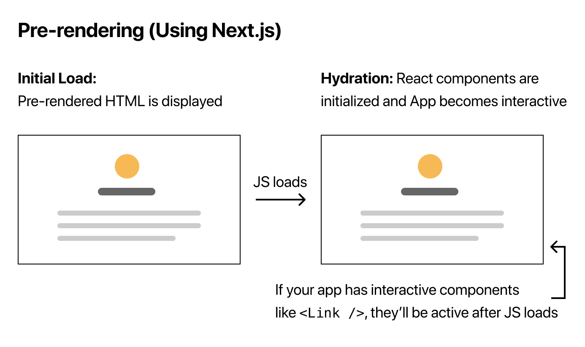

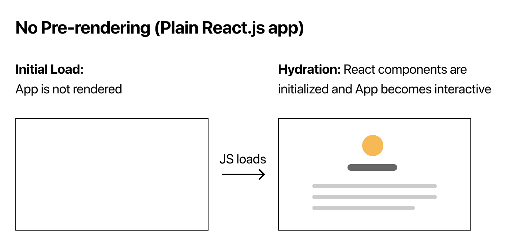

- Next.js 의 pre-rendering 방식에는 Static Generation(SSG)과 Server-side Rendering(SSR) 두가지가 있습니다.
- SSG 는 빌드시에 HTML 을 생성하는 pre-rendering 방식입니다. 그 이후 각 요청에는 사전 렌더링된 HTML 을 재사용합니다.
- SSR 은 매 요청에 대해 HTML 을 생성하는 방법입니다.

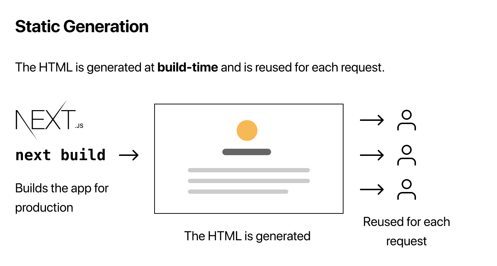

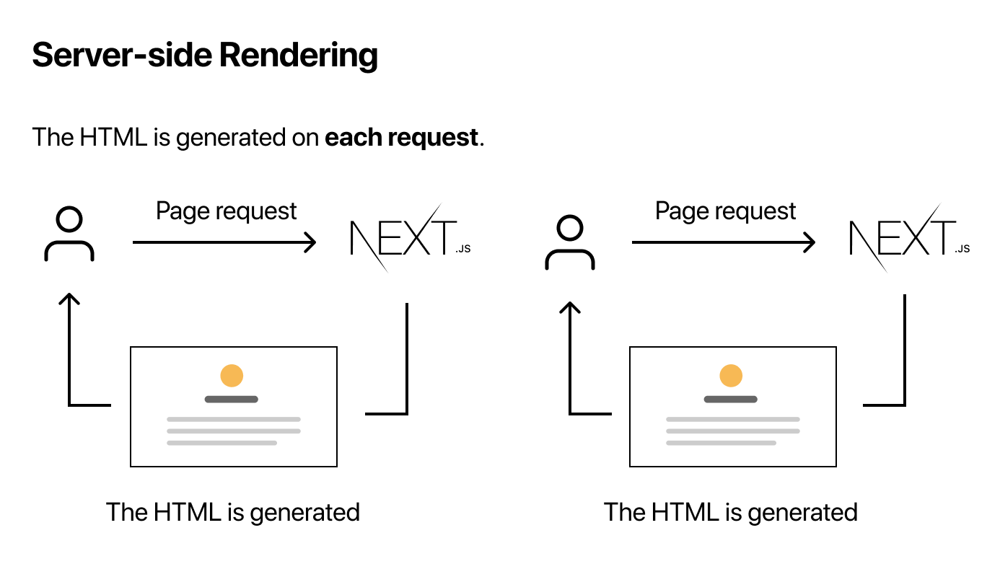

- 중요한것은 Next.js 에서는 각 페이지에서 사용 할 pre-rendering 방식을 선택 할 수 있다는 것입니다.

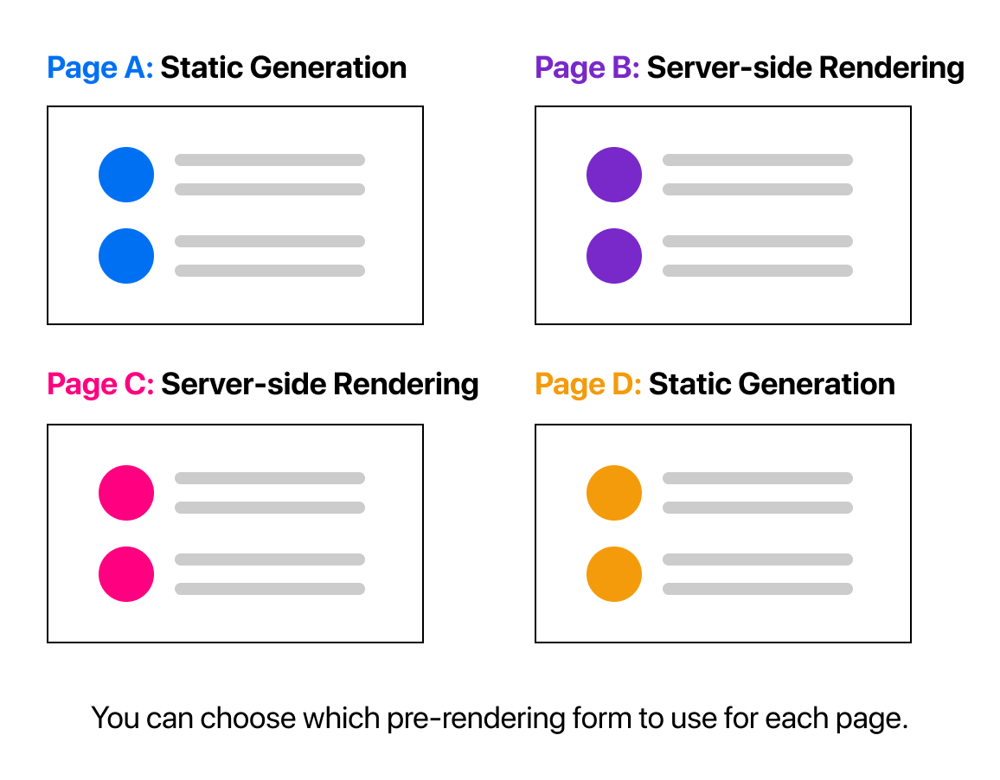

- CDN 을 이용해 페이지를 한번만 빌드 한 후 계속하여 서빙 할 수 있어 매 요청시마다 서버가 페이지를 렌더링 하는 것 보다 훨씬 빠르기 때문에 가능하다면 언제든 SSG 방식을 사용하는것이 좋습니다.
- 하지만 페이지에 자주 업데이트 되는 데이터가 표시되고 모든 요청에 따라 페이지 내용이 변경 될 수 있는 경우에는 SSR 방식을 사용해야 합니다.
- 혹은 pre-rendering 을 사용하지 않고 client-side Javascript 를 이용해 페이지를 렌더링 할 수도 있습니다.

# Data Fetching
---
- 일부 페이지의 경우 먼저 외부 데이터를 가져오지 않으면 HTML 을 렌더링 할 수 없는 경우가 있을 수 있습니다.
- Next.js 에서는 페이지 컴포넌트를 내보낼 때 비동기 함수인 `getStaticProps` 를 이용하여 외부 데이터를 가져와 페이지의 props 로 전달 할 수 있습니다.
- 기본적으로 `getStaticProps` 를 사용하면 "이 페이지에는 몇가지 데이터 종속성이 있으니 빌드 시 이 페이지를 pre-render 할 때 먼저 해결하세요!" 라고 이야기 하는 것 과 같습니다.
- 자 그럼 블로그 게시물을 markdown 파일로 추가 한 후 파일 시스템을 이용해 애플리케이션에 블로그 데이터를 추가해보도록 하겠습니다.
- 우선 최상단에 posts 폴더를 생성해주세요.
- 그리고 `posts/pre-rendering.md` 파일을 아래와 같이 추가해주세요.

```jsx
---
title: 'Two Forms of Pre-rendering'
date: '2020-01-01'
---

Next.js has two forms of pre-rendering: **Static Generation** and **Server-side Rendering**. The difference is in **when** it generates the HTML for a page.

- **Static Generation** is the pre-rendering method that generates the HTML at **build time**. The pre-rendered HTML is then _reused_ on each request.
- **Server-side Rendering** is the pre-rendering method that generates the HTML on **each request**.

Importantly, Next.js lets you **choose** which pre-rendering form to use for each page. You can create a "hybrid" Next.js app by using Static Generation for most pages and using Server-side Rendering for others.
```

- `posts/ssg-ssr.md` 파일도 아래와 같이 추가해주세요.

```jsx
---
title: 'When to Use Static Generation v.s. Server-side Rendering'
date: '2020-01-02'
---

We recommend using **Static Generation** (with and without data) whenever possible because your page can be built once and served by CDN, which makes it much faster than having a server render the page on every request.

You can use Static Generation for many types of pages, including:

- Marketing pages
- Blog posts
- E-commerce product listings
- Help and documentation

You should ask yourself: "Can I pre-render this page **ahead** of a user's request?" If the answer is yes, then you should choose Static Generation.

On the other hand, Static Generation is **not** a good idea if you cannot pre-render a page ahead of a user's request. Maybe your page shows frequently updated data, and the page content changes on every request.

In that case, you can use **Server-Side Rendering**. It will be slower, but the pre-rendered page will always be up-to-date. Or you can skip pre-rendering and use client-side JavaScript to populate data.
```

- markdown 파일을 자바스크립트 내에서 해석하기 위해 gray-matter 라는 의존성을 설치해주세요.

```jsx
npm install gray-matter
```

- 그리고 최상단에 lib 라는 폴더를 만들고 그 안에 `posts.js` 라는 파일을 아래와 같이 추가해주세요.

```jsx
import fs from 'fs'
import path from 'path'
import matter from 'gray-matter'

const postsDirectory = path.join(process.cwd(), 'posts')

export function getSortedPostsData() {
  // Get file names under /posts
  const fileNames = fs.readdirSync(postsDirectory)
  const allPostsData = fileNames.map(fileName => {
    // Remove ".md" from file name to get id
    const id = fileName.replace(/\\.md$/, '')

    // Read markdown file as string
    const fullPath = path.join(postsDirectory, fileName)
    const fileContents = fs.readFileSync(fullPath, 'utf8')

    // Use gray-matter to parse the post metadata section
    const matterResult = matter(fileContents)

    // Combine the data with the id
    return {
      id,
      ...matterResult.data
    }
  })
  // Sort posts by date
  return allPostsData.sort((a, b) => {
    if (a.date < b.date) {
      return 1
    } else {
      return -1
    }
  })
}
```

- 이제 pre-render 에서 `getSortedPostsData` 를 사용하기 위해 `getStaticProps` 를 사용해야 합니다.
- `pages/index.js` 파일에 아래와 같이 `getStaticProps` 함수를 추가해주세요.

```jsx
import { getSortedPostsData } from '../lib/posts'

export async function getStaticProps() {
  const allPostsData = getSortedPostsData()
  return {
    props: {
      allPostsData
    }
  }
}
```

- 그리고 `Home` 컴포넌트를 아래와 같이 수정해주세요.

```jsx
export default function Home({ allPostsData }) {
  return (
    <Layout home>
      {/* Keep the existing code here */}

      {/* Add this <section> tag below the existing <section> tag */}
      <section className={`${utilStyles.headingMd} ${utilStyles.padding1px}`}>
        <h2 className={utilStyles.headingLg}>Blog</h2>
        <ul className={utilStyles.list}>
          {allPostsData.map(({ id, date, title }) => (
            <li className={utilStyles.listItem} key={id}>
              {title}
              <br />
              {id}
              <br />
              {date}
            </li>
          ))}
        </ul>
      </section>
    </Layout>
  )
}
```

- 이제 첫 화면에서 블로그 데이터를 불러온 모습을 확인 하실 수 있습니다.

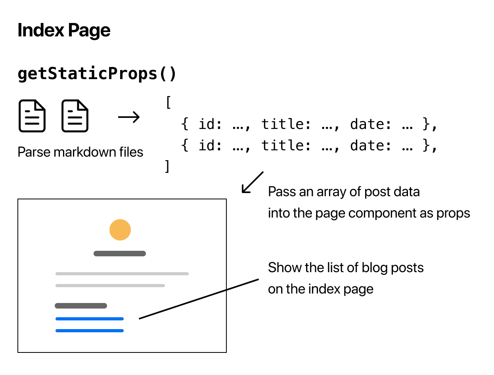

- getStaticProps 에서는 파일 시스템을 이용한 데이터 뿐만 아니라 외부 API 를 이용한 데이터도 가져 올 수 있고 데이터베이스에 직접 쿼리를 날릴 수도 있습니다.
- 이것이 가능한 이유는 getStaticProps 가 server-side 에서만 실행되기 때문입니다. 클라이언트 측에서는 실행 할 수 없으며 JS 번들에 포함되지도 않습니다.
- 때문에 쿼리 매게 변수나 HTTP 헤더 같은 요청시에 가져올 수 있는 데이터는 사용 할 수 없습니다.
- 만일 빌드시간이 아니라 요청마다 데이터를 가져와야 하는 경우에는 SSR 을 사용 할 수 있습니다.

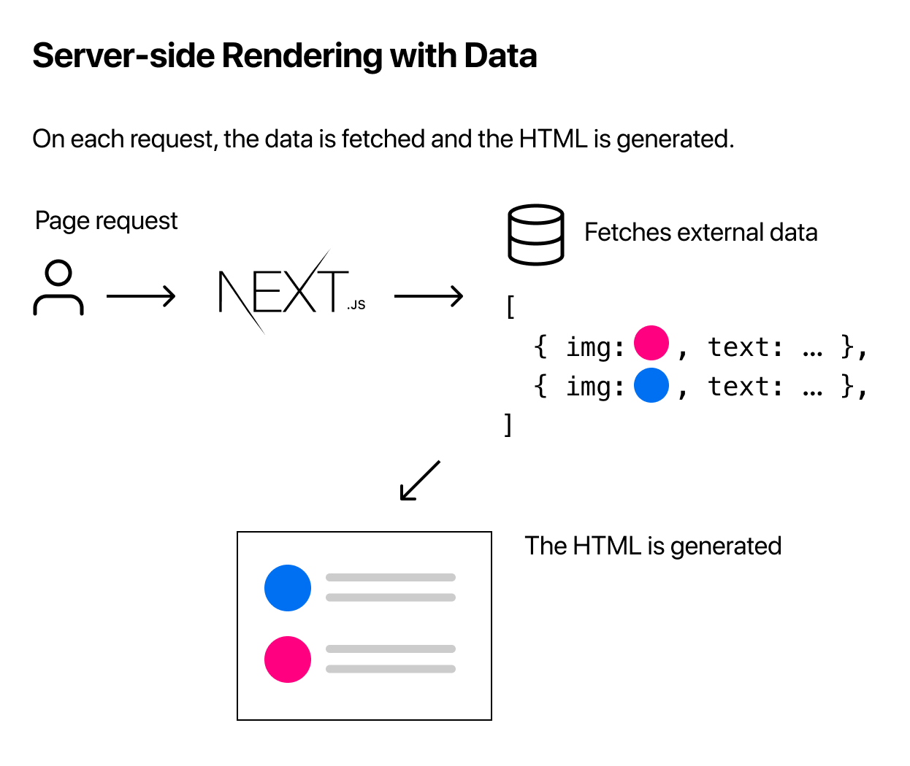

- SSR 을 사용하는 경우에는 `getStaticProps` 가 아닌 `getServerSideProps` 를 사용합니다.

```jsx
export async function getServerSideProps(context) {
  return {
    props: {
      // props for your component
    }
  }
}
```

- `getServerSideProps` 는 요청시에 호출되기에 context 에 요청별 매개 변수가 포함됩니다.
- 하지만 SSR 은 SSG 보다 속도가 느리기에 매번 요청이 필요한 페이지에서만 사용해야 합니다.
- SSR 은 이번 튜토리얼에서 구현하지 않습니다.
- 만일 pre-render 가 필요하지 않은 페이지라면 Client-side Rendering 을 사용하는 것도 방법입니다.

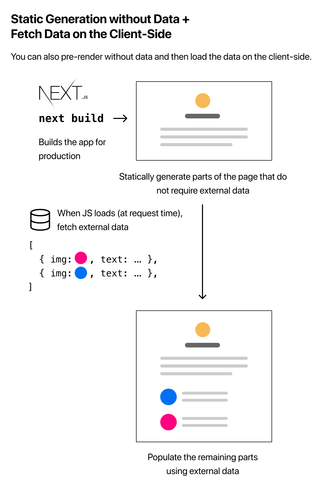

- Next.js 팀은 SWR 이라고 불리는 data fetching 을 위한 React hook 을 만들었습니다.
- 이는 client side 에서 data fetching 을 할 때에 유용합니다.

```jsx
import useSWR from 'swr'

function Profile() {
  const { data, error } = useSWR('/api/user', fetch)

  if (error) return <div>failed to load</div>
  if (!data) return <div>loading...</div>
  return <div>hello {data.name}!</div>
}
```

- SWR 은 캐싱, 재평가, 포커스 추적, 간격에 대한 리세팅 등을 처리합니다. 자세한 내용은 [여기](https://swr.vercel.app/)서 확인해주세요.

# Dynamic Routes
---
- 이번엔 각 페이지의 경로가 외부 데이터에 따라 달라지는 동적 경로를 사용하여 SSG 를 하는 방법에 대해 알아보도록 하겠습니다.

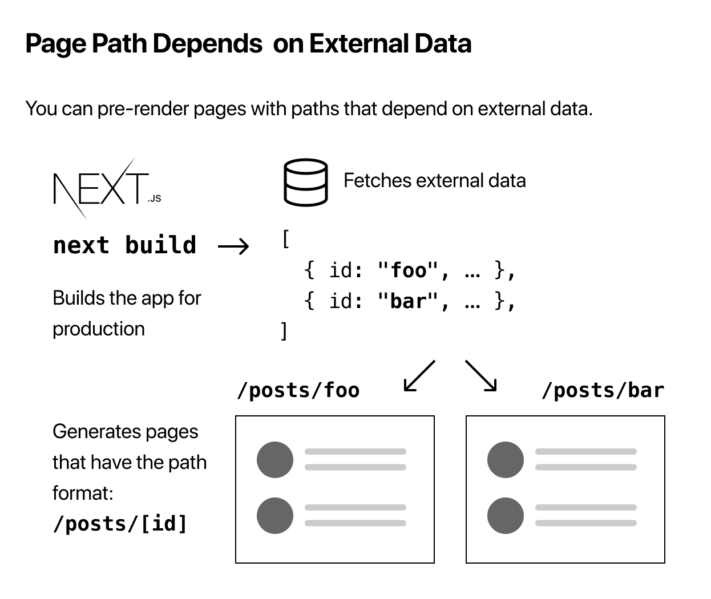

- 이번 튜토리얼에선 이전에 `posts` 폴더에 만들어둔 `[ssg-ssr.md](<http://ssg-ssr.md>)` 파일과 `[pre-rendering.md](<http://pre-rendering.md>)` 파일에 맞춰 `/posts/ssg-ssr` 과 `/posts/pre-rendering` 이라는 두개의 동적 경로가 생성돼야 합니다.
- 우선 `pages/posts` 폴더에 `[id].js` 라는 파일을 아래와 같이 추가해주세요. `[` 로 시작해 `]` 끝나는 이름의 페이지는 동적 경로 페이지를 생성하는 방법입니다.

```jsx
import Layout from '../../components/layout'

export default function Post() {
  return <Layout>...</Layout>
}

export async function getStaticPaths() {
  // Return a list of possible value for id
}

export async function getStaticProps({ params }) {
  // Fetch necessary data for the blog post using params.id
}
```

- 각 함수의 내용은 아래에서 추가 작성합니다.
- 동적 경로를 위해 getStaticPaths 라는 비동기 함수를 내보냅니다. 이 함수 내에서 `id` 에 들어 갈 수 있는 가능한 모든 값의 목록을 반환해야 합니다.
- 그리고 블로그 게시물 정보를 가져와 SSG 방식을 사용하기 위해 getStaticProps 도 이용합니다. getStaticProps 를 사용하는 파일이 동적 경로를 지원하기에 `params` 라는 매개 변수를 지원합니다.

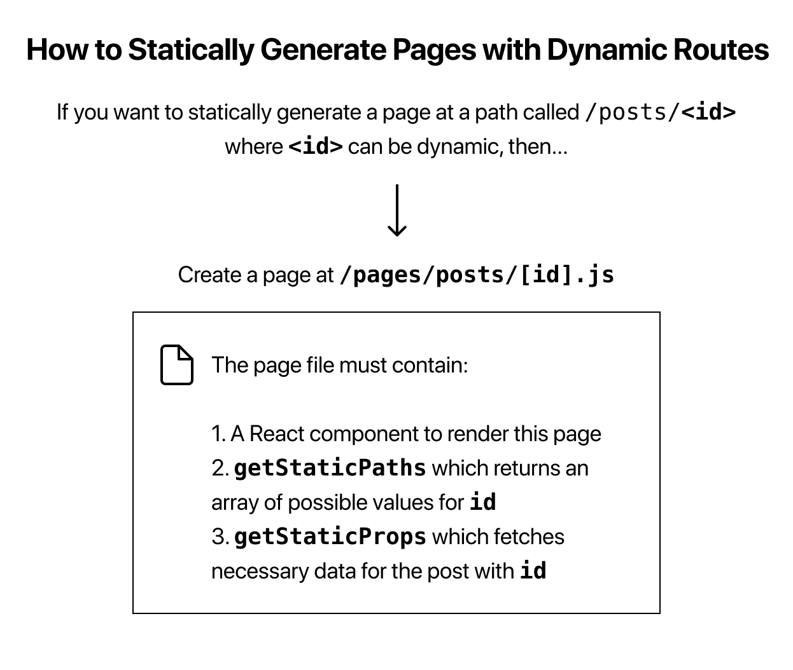

- 그리고 `lib/posts.js` 파일을 열어 아래와 같이 확장자명을 제외 한 posts 파일들의 이름 목록을 반환하는 `getAllPostIds` 함수를 추가합니다.

```jsx
export function getAllPostIds() {
  const fileNames = fs.readdirSync(postsDirectory)

  // Returns an array that looks like this:
  // [
  //   {
  //     params: {
  //       id: 'ssg-ssr'
  //     }
  //   },
  //   {
  //     params: {
  //       id: 'pre-rendering'
  //     }
  //   }
  // ]
  return fileNames.map(fileName => {
    return {
      params: {
        id: fileName.replace(/\\.md$/, '')
      }
    }
  })
}
```

- 반환되는 값은 단순한 문자열 배열이 아닌 위의 설명과 같이 각 개체에 params 객체를 갖고 해당 객체에 동적 경로 이름에 맞는 키와 파일 이름을 값으로 포함하는 객체 배열이여야 합니다.
- 그리고 `pages/posts/[id].js` 파일의 `getStaticPaths` 함수를 아래와 같이 수정해주세요.

```jsx
import { getAllPostIds } from '../../lib/posts'

export async function getStaticPaths() {
  const paths = getAllPostIds()
  return {
    paths,
    fallback: false
  }
}
```

- fallback 속성을 false 로 줄 경우 paths 에 들어있는 id 가 아닌 값이 경로로 들어 올 경우 404 페이지를 노출하게 합니다.
- 이제 블로그 게시물 정보를 가져 올 `getPostData` 함수를 `lib/posts.js` 파일에 아래와 같이 추가해줍니다.

```jsx
export function getPostData(id) {
  const fullPath = path.join(postsDirectory, `${id}.md`)
  const fileContents = fs.readFileSync(fullPath, 'utf8')

  // Use gray-matter to parse the post metadata section
  const matterResult = matter(fileContents)

  // Combine the data with the id
  return {
    id,
    ...matterResult.data
  }
}
```

- 그리고 `pages/posts/[id].js` 파일의 `getStaticProps` 함수를 아래와 같이 작성해주세요.

```jsx
import { getAllPostIds, getPostData } from '../../lib/posts'

export async function getStaticProps({ params }) {
  const postData = getPostData(params.id)
  return {
    props: {
      postData
    }
  }
}
```

- 이제 동적 경로로 받아온 id 값으로 블로그 게시물 정보를 가져오고 해당 값을 컴포넌트에 props 로 넘겨 사용 할 수 있습니다.
- 아래와 같이 Post 컴포넌트를 수정해주세요.

```jsx
export default function Post({ postData }) {
  return (
    <Layout>
      {postData.title}
      <br />
      {postData.id}
      <br />
      {postData.date}
    </Layout>
  )
}
```

- 이제 아래 주소로 접속 하면 블로그 게시물 정보를 불러 온 모습을 확인 할 수 있습니다.
    - [http://localhost:3000/posts/ssg-ssr](http://localhost:3000/posts/ssg-ssr)
    - [http://localhost:3000/posts/pre-rendering](http://localhost:3000/posts/pre-rendering)
- 아직은 게시물의 기본 정보만 가져왔을 뿐 게시물 내용은 가져오지 못했습니다.
- 게시물 내용을 가져오기 위해 마크다운 컨텐츠를 렌더링 해주는 remark 라이브러리를 설치해주세요.

```jsx
npm install remark remark-html
```

- 그리고 `lib/posts.js` 의 `getPostData` 함수를 아래와 같이 수정해주세요.

```jsx
import remark from 'remark'
import html from 'remark-html'

export async function getPostData(id) {
  const fullPath = path.join(postsDirectory, `${id}.md`)
  const fileContents = fs.readFileSync(fullPath, 'utf8')

  // Use gray-matter to parse the post metadata section
  const matterResult = matter(fileContents)

  // Use remark to convert markdown into HTML string
  const processedContent = await remark()
    .use(html)
    .process(matterResult.content)
  const contentHtml = processedContent.toString()

  // Combine the data with the id and contentHtml
  return {
    id,
    contentHtml,
    ...matterResult.data
  }
}
```

- remark 함수는 비동기 함수이기 때문에 await 를 사용하기 위해 `getPostData` 함수도 async 함수로 변경해주세요.
- 그리고 `pages/posts/[id].js` 파일의 `getStaticProps` 함수에서 `getPostData` 함수를 비동기로 가져오도록 아래와 같이 변경해주세요.

```jsx
export async function getStaticProps({ params }) {
  // Add the "await" keyword like this:
  const postData = await getPostData(params.id)
  // ...
}
```

- 그리고 Post 컴포넌트를 아래와 같이 수정해주세요.

```jsx
export default function Post({ postData }) {
  return (
    <Layout>
      {postData.title}
      <br />
      {postData.id}
      <br />
      {postData.date}
      <br />
      <div dangerouslySetInnerHTML={{ __html: postData.contentHtml }} />
    </Layout>
  )
}
```

- 이제 게시물의 내용이 잘 노출되는 것을 확인 하실 수 있습니다.
- 이제 위에서 배운 내용을 가지고 코드와 스타일을 조금 수정해주도록 하겠습니다.
- Update `pages/posts/[id].js`

```jsx
npm install date-fns
```

```jsx
// add components/date.js

import { parseISO, format } from 'date-fns'

export default function Date({ dateString }) {
  const date = parseISO(dateString)
  return <time dateTime={dateString}>{format(date, 'LLLL d, yyyy')}</time>
}
```

```jsx
// Add this import
import Head from 'next/head'
import Date from '../../components/date'

// Add this import at the top of the file
import utilStyles from '../../styles/utils.module.css'

export default function Post({ postData }) {
  return (
    <Layout>
      <Head>
        <title>{postData.title}</title>
      </Head>
      <article>
        <h1 className={utilStyles.headingXl}>{postData.title}</h1>
        <div className={utilStyles.lightText}>
          <Date dateString={postData.date} />
        </div>
        <div dangerouslySetInnerHTML={{ __html: postData.contentHtml }} />
      </article>
    </Layout>
  )
}
```

- Update `pages/index.js`

```jsx
// Add this import
import Link from 'next/link'
import Date from '../components/date'

export default function Home({ postData }) {
  return (
    <Layout>
			{/* Keep the existing code here */}
      
			<ul className={utilStyles.list}>
	       {
		       allPostsData.map(({id, date, title}) => (
						{/* Replace li tag with this */}
	           <li className={utilStyles.listItem} key={id}>
	             <Link href={`/posts/${id}`}>
                 <a>{title}</a>
               </Link>
               <br/>
               <small className={utilStyles.lightText}>
                 <Date dateString={date} />
               </small>
             </li>
           ))
         }
       </ul>

			{/* Keep the existing code here */}
    </Layout>
  )
}
```

- 이렇게 홈페이지에서 게시물 목록까지 노출해주며 블로그 프로젝트는 완성이 되었습니다.
- `getStaticProps` 와 마찬가지로 `getStaticPaths` 함수에서도 외부 API 데이터 등을 가져올 수 있습니다.
- 동적 경로를 사용 할 파일 이름을 `[...id].js` 처럼 `...` 을 이용 할 경우 모든 경로를 캡쳐 하도록 확장 할 수 있습니다.
- `[...id].js` 은 `/posts/a` 와도 매칭되고 `/posts/a/b` 와도 매칭되고 `/posts/a/b/c` 와도 매칭됩니다.
- 이 경우엔 `getStaticPaths` 에서 아래와 같이 배열을 반환해야 합니다.

```jsx
return [
  {
    params: {
      // Statically Generates /posts/a/b/c
      id: ['a', 'b', 'c']
    }
  }
  //...
]
```

```jsx
export async function getStaticProps({ params }) {
  // params.id will be like ['a', 'b', 'c']
}
```

- 만일 커스텀 404 페이지를 만들고 싶다면 `pages/404.js` 를 생성해주면 됩니다. 이 파일은 빌드 시 정적으로 생성됩니다.

```jsx
// pages/404.js
export default function Custom404() {
  return <h1>404 - Page Not Found</h1>
}
```

# API Routes
---
- Next.js 에선 API Routes 가 지원되어 API endpoint 를 Node.js 서버리스 함수로 쉽게 생성 할 수 있습니다.
- 이번 프로젝트에 필요하진 않지만 간단히 알아보도록 하겠습니다.
- `pages/api` 폴더 내에 다음과 같은 형식을 가진 함수를 작성하여 API endpoint 를 생성 할 수 있습니다.

```jsx
// req = HTTP incoming message, res = HTTP server response
export default function handler(req, res) {
  // ...
}
```

- `pages/api/hello.js` 파일을 아래와 같이 만들어 간단한 API endpoint 를 만들어보겠습니다.

```jsx
export default function handler(req, res) {
  res.status(200).json({ text: 'Hello' })
}
```

- 이제 [`http://localhost:3000/api/hello`](http://localhost:3000/api/hello) 로 접속 시 `{"text":"Hello"}` 라는 값이 request 로 반환되는 것을 확인 하실 수 있습니다.
- `getStaticProps` 나 `getStaticPaths` 에서 API Route 를 fetch 하려 하면 안됩니다. (서버측에서만 실행되기 때문)
- 대신 `getStaticProps` 나 `getStaticPaths` 에 직접 server-side code 를 작성하세요.
- API Route 를 사용하는 좋은 케이스는 form 입력을 처리하는 api 를 만들어 직접 데이터베이스에 저장하는 코드를 작성 할 수 있습니다.
- API Route 코드는 클라이언트 번들의 일부가 아니므로 안전하게 서버측 코드를 작성 할 수 있습니다.
- API Route 또한 동적으로 경로를 설정 할 수 있습니다. 자세한 내용은 [여기](https://nextjs.org/docs/api-routes/dynamic-api-routes)에서 확인해주세요.

# Deploying
---
- Next.js 로 만든 프로젝트는 Next.js 와 같은 개발진이 만든 Vercel 이라는 `Jam Stack` 배포 플랫폼을 이용해 간단하게 배포가 가능합니다.
    - `Jam Stack` 이란 Javscript, API, Markup 만으로 이루어진 웹 Stack 을 이야기 합니다.
    - 이중 가장 중요한 것이 Markup 인데 최대한 많은 페이지를 미리 Static HTML 로 정적 생성하여(SSG) 캐싱을 이용해 웹서버의 사용량을 줄이고 사용자의 `First meaningful paint` 속도를 높히자는 의미가 있습니다.
    - 자세한 내용은 아래 글을 참고해주세요.
        - [https://jbee.io/web/jam-stack/](https://jbee.io/web/jam-stack/)
- 우선 깃허브에 새로운 레파지토리를 생성하고 우리가 만든 프로젝트를 푸시해주세요.
- 그리고 [https://vercel.com/signup](https://vercel.com/signup) 에 들어가 새로운 계정을 만들어주세요. `Continue with GitHub` 를 선택해 깃허브 아이디로 진행하면 편리합니다.
- 계정을 만들고 나면 아까 생성한 깃 레파지토리를 Vercel 에 import 해주세요.
- 아래와 같은 설정은 기본값을 이용 할 수 있어 따로 변경 할 필요가 없습니다. Next.js 앱을 가지고 있음을 자동으로 감지하고 최적의 빌드 설정을 선택합니다.
    - Project Name
    - Root Directory
    - Build Command
    - Output Directory
    - Development Command
- 이제 Deploy 를 하면 Next.js app 이 자동으로 빌드가 시작됩니다.
- 빌드게 끝나면 배포된 URL 이 생성되어 바로 확인해볼 수 있습니다.
- 이제 master 브랜치에 새로운 푸쉬가 생길 때 마다 자동으로 빌드와 배포가 진행됩니다.
- 만일 다음 과정과 같이 Pull Request 를 이용하여 코드를 업데이트 할 경우 vercel 이 production 에 배포되기 전에 preview deployment URL 이 제공되어 미리 결과물을 테스트 할 수 있습니다.
    - Create a new **branch** on your app.
    - Make some changes and push to GitHub.
    - Create a new **pull request** ([GitHub help page](https://help.github.com/en/github/collaborating-with-issues-and-pull-requests/creating-a-pull-request)).

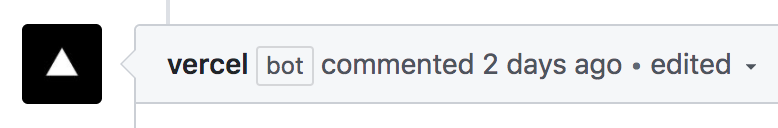

- preview deployment 에 문제가 없다면 코드를 master 브랜치에 merge 해 프로덕션에 배포 할 수 있습니다.
- 이것이 Vercel 에서 이야기 하는 **DPS**(**D**evelop, **P**review and **S**hip) 워크플로우 입니다.
    - **Develop**: We’ve written code in Next.js and used the Next.js development server running to take advantage of its hot reloading feature.
    - **Preview**: We’ve pushed changes to a branch on GitHub, and Vercel created a preview deployment that’s available via a URL. We can share this preview URL with others for feedback. In addition to doing _code reviews_, you can do _deployment previews_.
    - **Ship**: We’ve merged the pull request to `main` to ship to production.

## 이후 작성 할 내용
---
1. SWR

## 참고 자료
---
- [Create a Next.js App](https://nextjs.org/learn/basics/create-nextjs-app)