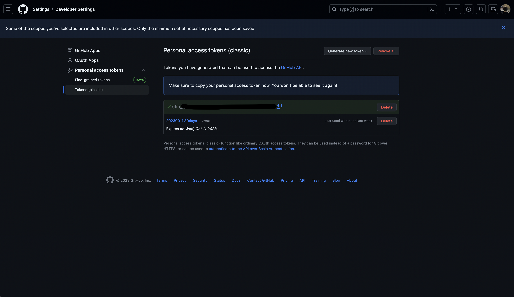

맥북과 아이폰간의 데이터를 동기화하는 방법을 소개하려고 합니다. 이 과정에서는 Obsidian Git 플러그인과 GitHub 레포지토리를 활용해 데이터를 안전하게 백업하고 동기화할 것입니다.
(Working Copy 를 이용하지 않습니다!)

아래 내용을 따라오시기 위해 깃과 터미널 명령어에 대한 기초적인 지식이 있으시다면 더욱 수월하게 진행하실 수 있습니다. 하지만 걱정하지 마세요. 깃과 터미널 명령어에 대한 세부적인 설명은 생략하였으나, 이 글에서는 그런 기술적인 지식 없이도 충분히 따라올 수 있도록 상세하게 작성하였으니 천천히 따라오세요.

Obsidian 을 열고 `Create new vault`에서 `Create` 버튼을 클릭해줍니다.

`Vault name`과 `Location` 설정 후, `Create` 버튼을 클릭해줍니다.

생성된 볼트에 새 노트를 하나 작성해줍니다.

이후 `Preference` > `Community plugins`로 이동하여 `Turn on community plugins` 버튼을 클릭해줍니다.

`Community plugins`의 `Browse` 버튼을 클릭해줍니다.

검색창에 `Obsidian Git` 입력 후 선택해줍니다.

`Install` 버튼 클릭하여 플러그인을 설치해줍니다.

![[62.png]]
설치 완료 후 `Enable` 클릭하여 플러그인을 활성화해줍니다.

그러면 우측 상단에 이런 메시지가 노출됩니다. 메시지는 Obsidian 볼트 디렉토리가 Git 레포지토리와 연동이 되어있지 않다는 내용입니다. 이제 Obsidian 볼트 디렉토리와 Git 레포지토리를 연동해주어야 합니다.

우선 Git 레포지토리를 생성부터 해주어야 하는데요. Git 저장소로는 `Github` 를 사용할 것이기 때문에 [https://github.com](https://github.com) 사이트로 접속하여 계정이 없다면 회원가입을 진행해줍니다.

프로필에서 좌측 상단의 `Repositories` 탭을 클릭해줍니다.

우측 상단 `New` 버튼을 클릭하여 새 레포지토리 생성 페이지로 이동해줍니다.

아래 3가지 정보를 입력해주세요.

- `Repository name`: 가능하다면 Obsidian 볼트의 이름과 동일하게 설정해주세요.
- `Description`: 레포지토리에 대한 설명인데 굳이 작성 안하셔도 됩니다.
- `Public/Private`: 백업한 Obsidian 데이터를 외부에 공개할지에 대한 여부입니다. 공개하기 싫으시다면 `Private` 으로 체크해주세요.

모두 입력한 뒤 하단의 `Create repository` 버튼을 클릭해주세요.

그럼 이렇게 새로운 레포지토리가 생성되었습니다.

이제 생성된 레포지토리를 Obsidian 볼트 디렉토리와 연동해주어야 합니다.

만일 PC 에 Git 설치가 되어있지 않다면 먼저 Git 설치를 진행해주셔야 합니다.

Git 설치 방법은 구글에 검색해 보시거나 아래 글등을 참고하여 따로 설치를 진행해주세요.
https://www.lainyzine.com/ko/article/how-to-install-latest-version-of-git-on-macos/

Git 설치를 진행하신 후 터미널을 열어주세요.

터미널을 열고, `cd` 명령어로 Obsidian 볼트 디렉토리로 이동해줍니다.

`ls` 명령어를 이용하면 위에서 작성한 노트의 md 파일을 확인하실 수 있습니다.

`git init` 명령어로 Git 저장소 초기화를 해줍니다.

`git remote add origin {git-url}` 명령어로 현재 디렉토리와 Github 레포지토리를 연동해줍니다.

`{git-url}` 부분은 레포지토리 주소를 넣어주세요.

`{git-url}` 부분에 넣어야 하는 주소는 Github 레포지토리의 위 부분에 적혀있습니다.

우측의 복사 버튼을 누르면 복사해서 사용하실 수 있습니다.

`git branch -M main` 명령어로 브랜치를 `main` 으로 변경해줍니다.

`git add .` 명령어로 변경사항을 추가해줍니다.

`git commit -m "init"` 명령어로 변경사항을 커밋해줍니다.

`init` 부분은 커밋 메시지로 다른 메시지로 변경해도 무방합니다.

`git push -u origin main` 명령어로 커밋 내역을 깃허브에 푸시해줍니다.

이후 계정정보를 입력하여 인증을 진행해야 합니다.

`Username`은 깃허브 계정 아이디를 입력해주세요.

하지만 `Password`는 비밀번호가 아닌 `토큰`을 발급받아 입력하셔야 합니다.

2021년부터 깃허브가 비밀번호 인증을 제한하였기 때문입니다.

Github 우측 상단의 프로필을 클릭하고 `Settings` 를 클릭해주세요.

좌측 하단의 `Developer settings` 클릭해주세요.

`Personal access tokens` > `Tokens (classic)` 을 클릭해주세요.

우측 상단의 `Generate new token` > `Generate new token (classic)` 를 클릭해주세요.

Github 계정 비밀번호를 입력해줍니다.

다음 세 가지를 입력해줍니다.

- `Note`: 토큰의 이름을 지정합니다. 이름은 자유롭게 설정할 수 있습니다.
- `Expiration`: 토큰의 유효기간을 설정합니다. 보안상, 무기한으로 설정하는 것은 권장하지 않습니다.
- `Select scopes`: 권한 범위에서는 `repo`를 반드시 체크해야합니다. 그 외에는 자유롭게 체크해주세요.

하단의 `Generate token`을 클릭하여 토큰을 생성합니다.

그러면 이런식으로 토큰이 생성됩니다.

이 토큰은 생성될 때 **딱 한번**만 확인하실 수 있으므로 반드시 복사하여 안전한 곳에 저장해두세요. (페이지를 이탈하면 재확인이 불가능합니다.)

이 토큰이 유출되는 것은 비밀번호가 유출되는 것과 동일합니다. **반드시 안전한 곳에 저장하세요.**

이후 위 토큰을 터미널의 `Password` 입력란에 입력하면 Push 가 완료됩니다.

Push 가 완료되면 Github 레포지토리에 작성한 Obsidian 파일들이 백업된 것을 확인하실 수 있습니다.

![[24.png]]
이후 노트를 수정한 뒤

좌측의 `Open command palette` 버튼을 클릭합니다.

검색창에 `Obsidian Git: Open source control view` 를 입력하고 실행합니다.

Git 뷰에서 상단의 우측에서 3번째 `Pull` 버튼을 클릭합니다.

그러면 `Changes` 에 변경된 파일 내역이 노출됩니다.

이후, Git 뷰에서 상단의 좌측에서 첫번째 백업 버튼을 눌러 변경사항을 저장합니다.

백업 진행 시, 우측 상단에 이러한 메시지가 노출되며 Commit/Push가 자동으로 진행됩니다.

이후 깃허브 레포지토리에서 수정한 노트의 md 파일을 확인해보면 노트가 잘 백업된 것을 확인할 수 있습니다.

이제까지 설명한 과정을 따르면 PC 의 Obsidian 볼트와 GitHub 레포지토리의 연동이 완료된 상태입니다.

다음 단계로, 해당 GitHub 레포지토리를 아이폰의 Obsidian 볼트와 연동해보겠습니다.

연동 방법의 이론적인 배경을 간단히 설명하자면, Git 과 연동된 디렉토리에는 보통 `.git` 이라는 숨겨진 폴더가 생성됩니다. 이 디렉토리에는 연동된 Git 레포지토리에 대한 정보가 저장되어 있습니다.

아이폰의 Obsidian 볼트와 레포지토리를 연동하기 위해서는 이 `.git` 폴더를 아이폰의 Obsidian 볼트가 위치한 디렉토리로 복사해주어야 합니다. 이 과정은 PC 에서 이미 설정한 Obsidian 볼트 디렉토리를 아이폰으로 그대로 옮기는 것에 해당됩니다.

아래에서 이 방법을 상세히 설명하니, 계속 따라오시면 됩니다.

아이폰에 Obsidian 앱을 설치 후, `Create New Vault` 를 통해 새 볼트를 생성합니다.

다음 두가지를 입력하고 `Create` 버튼을 눌러 볼트를 생성해주세요.

- `Vault Name`: 되도록이면 기존에 만들어둔 볼트의 이름과 동일하게 설정해주세요.
- `Store in iCloud`: iCloud 를 사용하지 않을 것이므로 `Off` 로 설정해주세요.

이후 PC 에서 볼트가 저장된 디렉토리를 아이폰으로 전송해야 합니다. 어떠한 방법을 사용하셔도 무방하지만 필자는 `에어드랍` 을 이용하였습니다.

이런 식으로 PC 의 Obsidian 볼트 디렉토리를 아이폰의 Obsidian 볼트 디렉토리가 있는 위치에 그대로 덮어씌워주세요.

그럼 이렇게 PC 에서 작성 한 노트가 복사되어 옮겨진 것을 확인하실 수 있습니다.

이후 좌측 상단의 탭 버튼을 눌러 좌측 탭을 열어주고 탭 우측 상단의 설정 버튼을 눌러줍니다.

`Community plugins` 를 눌러줍니다.

`Turn on community plugins` 버튼을 눌러줍니다.

`Browse` 버튼을 눌러줍니다.

`Obsidian Git` 플러그인을 검색해줍니다.

`Install` 해주고, `Enable` 해줍니다.

이후 다시 설정 화면으로 돌아와 최하단의 `Community plugins > Obsidian Git` 을 눌러줍니다.

`Authentication/Commit Author` 부분에 깃허브 계정 관련한 아래 네가지 정보를 입력해주세요.

- `Username`: 깃허브 아이디를 입력해주세요.
- `Password`: 아까 발급받은 깃허브 토큰을 입력해주세요.
- `Author name`: 깃허브 계정에 등록된 이름을 입력해주세요.
- `Author email`: 깃허브 계정에 등록된 이메일을 입력해주세요.

이후 메인화면으로 돌아와 하단 탭의 메뉴 버튼을 누르고 `Open command palette` 를 눌러주세요.

마찬가지로 `Obsidian Git: Open source control view` 를 입력하고 실행합니다.

그러면 이렇게 우측 탭에 Git 뷰가 나타납니다. 이후에는 우측 부분을 슬라이드 하여 우측 탭을 열 수 있습니다.

이제 이렇게 노트를 수정하면

마찬가지로 Git 뷰의 `Changes` 부분에서 변경 내역을 확인하실 수 있습니다.

이후, 마찬가지로 Git 뷰에서 백업 버튼을 눌러 변경사항을 저장합니다.

그러면 이런 식으로 토스트 메시지가 노출되며 Push 가 정상적으로 동작함을 확인할 수 있습니다.

이제 다시 PC 의 Git 뷰에서 `Pull` 버튼을 눌러주면

이로써 아이폰에서의 수정과 백업을 PC 에서도 손쉽게 확인할 수 있습니다. 반대로 PC 에서의 변경사항 역시 아이폰에서 Pull 을 받아 확인이 가능합니다.

이렇게 GitHub 레포지토리를 활용해 맥과 아이폰 간의 데이터 동기화를 성공적으로 완료했습니다.
이 방법은 윈도우와 안드로이드에서도 마찬가지로 적용 가능하며, 기기의 수에 상관없이 무료로 이용할 수 있습니다.

추가로, Obsidian Git 설정에서 자동 백업과 Pull 기능도 활용할 수 있습니다.

그러나 주의할 점이 있습니다. 두 개 이상의 기기에서 동일한 파일을 수정 후 백업하려고 하면, 늦게 백업을 실행하는 기기에서 충돌(`conflict`)이 발생할 가능성이 있습니다.
이는 깃의 기본 메커니즘에서 출발한 현상으로, 충돌을 피하기 위해서는 하나의 기기에서 수정을 마친 뒤 꼭 백업을 하고, 다른 기기에서 사용하기 전에는 꼭 Pull 명령을 한번 실행하고 나서 사용하는 것이 좋습니다.

필자는 수동으로 백업/Pull 을 하며 옵시디언을 이용하고 있습니다.

만약 충돌이나 기타 문제가 발생한다 해도, 지금까지 소개한 방법으로 Obsidian 볼트 디렉토리와 Git 설정을 초기화하면 마지막으로 백업한 데이터로 쉽게 복구할 수 있으니 크게 걱정하지는 않으셔도 됩니다.

이상으로 Obsidian Git 을 이용하여 맥북과 아이폰간의 데이터를 동기화하는 방법에 대한 설명을 마무리하겠습니다.