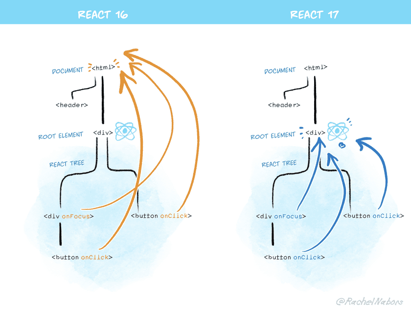

> ⚠️ 해당 글의 내용과 예시 코드, 이미지는 모두 참고 자료에서 가져 와 정리 한 것입니다.

작년 10월 20일 React v17.0 이 발표되었습니다.

React 17 은 새로운 기능의 추가보다는 React 자체의 업그레이드를 손쉽게 만들기 위한 기능에 초점이 맞춰졌습니다.

React 17 의 변경사항중 중요한 몇가지만 이야기 해보도록 하겠습니다.

# 점진적 업그레이드
---
- 일반적으로 새로운 버전으로의 업그레이드는 앱 전체를 대상으로 하지만 코드가 작성된지 몇 년이 지난 경우, 활발하게 유지보수가 이뤄지는 코드가 아니라면 major 버전을 업그레이드 하는 것이 쉽지 않을 수 있습니다.
- 이 때문에 리액트의 두 버전을 동시에 사용하려는 움직임들이 있었는데 이는 안정성과 이벤트 처리등에 문제가 발생했습니다.
- 이를 해결하기 위해 React 17 부터는 앱을 부분적으로 업그레이드 할 수 있는 방법을 제공했습니다.
- 특정 영역에 한해 다른 버전을 사용하는 경우, 다른 버전의 React 를 lazy-load 형태로 적용 할 수 있습니다.
    - [CRA로 작성된 데모](https://github.com/reactjs/react-gradual-upgrade-demo/)
- 하지만 이것은 코드를 한번에 업데이트 하기 어려운 사용자들을 위한 새로운 선택지 일 뿐이지 여러가지 React 버전을 함께 사용하는것이 좋다는 의미는 아닙니다.
- React 팀은 "늘 하나의 React 버전을 사용하라"고 강조하고 있습니다.
    - "단일 버전의 React 를 사용하는 것은 많은 경우에 코드 복잡도를 낮추고, 유저가 React core 를 두 번 다운로드하는 경우를 피하도록 도와줍니다."

# 이벤트 위임 방식 변경
---
- 위에서 이야기 했듯이 기존에도 리액트의 두 버전을 동시에 사용 할 수는 있었지만 Event delegation(이벤트 위임) 과 관련된 문제가 있었습니다.
- 우리가 React JSX 에 이벤트 핸들러를 부착하면 해당 handler 는 사실 우리가 작성한 위치가 아니라 document 레벨에 붙게 됩니다.
- 이는 이벤트 추가 등의 부담을 줄이기 위해 리액트 팀이 event delegation 을 적극적으로 활용했다는 것인데 이 때문에 e.stopPropagation 에서 문제가 발생합니다.
- 두개의 React tree 가 서로 nest 된 형태로 존재한다고 가정하고, 두곳에서 모두 onClick event handler 를 element 에 할당하면, 이 handler 는 모두 document 레벨에 할당됩니다.

```jsx
// legacy react root
import React from 'react' // 16.12
import ReactDOM from 'react-dom' //16.12

function modernReact() {
  return ReactDOM.render(
    React.createElement(
      'div',
      {
        'onClick': () => console.log('modern react!'),
      },
      null,
    ),
    document.getElementById('modernroot'),
  )
}

import React from 'react' // 16.8
import ReactDOM from 'react-dom' // 16.8

function legacyReact() {
  return ReactDOM.render(
    React.createElement(
      'div',
      {
        'onClick': () => console.log('legacy react!'),
      },
      null,
    ),
    document.getElementById('legacyroot'),
  )
}
```

```jsx
<html>
  <body>
    <div>
      <div id="modernroot">
        <div id="legacyroot">
        </div>
      </div>
    </div>
  </body>
</html>
```

- 이 경우 onclick handler 는 모두 document 에 부착되고 해당 element 를 유저가 클릭하면 event 는 document 까지 bubbling 되고, document 에 위임 된 handler 가 동작합니다.
- 이때 문제는, 하위 React 에서 e.stopPropagation 을 요청해도 이미 실제 DOM event 는 document 레벨까지 bubbling 된 상태이기 때문에 e.stopPropagation 을 진행해도 다른 React 에서 관리되는 event handler 에 전파되는 것을 막을 방법이 없게 됩니다.
- 이미 Atom 팀에서 이 문제를 몇년전에 직면하여 해결책을 주장했고 React 팀은 이를 받아들여 React 17 부터는 Event 가 document 가 아닌 React Tree Root 로 delegate(위임) 됩니다.



- 이렇게 보다 안전하게 이벤트 흐름을 관리 할 수 있게 되었습니다.
- 하지만 만약 개발자가 React event 를 받기 위한 이유 등으로 document 에 등록해둔 handler 가 있다면 React 17 부턴 document 까지 이벤트가 bubbling 되지 않기 때문에 동작이 보장되지 않는다는 side effect 가 있습니다.

# 새로운 JSX Transform
---
- JSX 는 javascript 로 transpile 되지 않으면 브라우저가 이해 하지 못하기에 JSX 코드는 React.createElement 를 사용하도록 변환하는 과정이 필요합니다.

```jsx
import React from 'react';

// 작성된 코드
function App() {  
  return <h1>Hello World</h1>;
}

// 변환된 코드
function App() {  
  return React.createElement('h1', null, 'Hello world');
}
```

- 그러나 이는 JSX 코드와 같은 스코프 내에 React 라이브러리가 코드에 직접적으로 사용되지 않더라도 임포트 되어 있어야 한다는 문제와 일부 성능 향상과 단순화를 지원하지 못한다는 문제가 있었습니다.
- 그래서 React 팀은 Babel 팀과의 협업을 통해 새로운 Transform 을 제공하여 위 문제를 해결하였습니다.

```jsx
// 작성된 코드(React import 없이 작성)
function App() {  
  return <h1>Hello World</h1>;
}

// 변환된 코드(아래 모듈은 컴파일러를 통해 자동 import)
import {jsx as _jsx} from 'react/jsx-runtime';

function App() {  
  return _jsx('h1', { children: 'Hello world' });
}
```

- 새로운 Transform 은 React 17을 통해 사용 할 수 있으며, 컴파일러(Babel, TS) 전용 entry point 를 제공해 React.createElement 대신 특별한 함수를 자동으로 import 하고 사용되도록 변환됩니다.
- 더 자세한 내용은 아래 링크를 확인해주세요.
    - [https://reactjs.org/blog/2020/09/22/introducing-the-new-jsx-transform.html](https://reactjs.org/blog/2020/09/22/introducing-the-new-jsx-transform.html)

# Event Pooling 제거
---
- React 에서는 레거시 브라우저에서 서로 다른 이벤트에 대해서 동일한 이벤트 객체를 사용해 성능을 높이기 위해 이벤트 핸들러가 SyntheticEvent 객체를 사용하였습니다.
- 이는 재사용 시마다 모든 이벤트 필드의 값을 null 로 설정하는 형태였기에 값이 초기화 되기 전 값을 사용하려면 `e.persist()` 를 호출하는 등의 처리가 필요했습니다.
- 하지만 이는 모던 브라우저에서는 성능상 이득을 제공하지 못하며, 사용상 많은 혼란을 가중하는 역할을 하는등의 문제로 React 17 부터는 제거되었습니다.
- 물론 여전히 `e.persist()` 메서드는 남아있지만 아무런 동작을 하지 않습니다.
- React Event Pooling 에 대한 더 자세한 내용은 아래 링크를 참고해주세요.
    - [https://ko.reactjs.org/docs/events.html](https://ko.reactjs.org/docs/events.html)
    - [](https://medium.com/react-native-seoul/react-%EB%A6%AC%EC%95%A1%ED%8A%B8%EB%A5%BC-%EC%B2%98%EC%9D%8C%EB%B6%80%ED%84%B0-%EB%B0%B0%EC%9B%8C%EB%B3%B4%EC%9E%90-06-%ED%95%A9%EC%84%B1-%EC%9D%B4%EB%B2%A4%ED%8A%B8%EC%99%80-event-pooling-6b4a0801c9b9)[https://medium.com/react-native-seoul/react-리액트를-처음부터-배워보자-06-합성-이벤트와-event-pooling-6b4a0801c9b9](https://medium.com/react-native-seoul/react-%EB%A6%AC%EC%95%A1%ED%8A%B8%EB%A5%BC-%EC%B2%98%EC%9D%8C%EB%B6%80%ED%84%B0-%EB%B0%B0%EC%9B%8C%EB%B3%B4%EC%9E%90-06-%ED%95%A9%EC%84%B1-%EC%9D%B4%EB%B2%A4%ED%8A%B8%EC%99%80-event-pooling-6b4a0801c9b9)

# 보다 명확한 useEffect의 cleanup(정리) 시점
---
- useEffecct hook 은 렌더링 이후로 비동기적으로 동작합니다.
- 하지만 useEffect 의 cleanup 함수는 동기적으로 동작하여 의도하지 않은 rendering block 을 일으키는 현상이 있었습니다.
    - (예를 들어 페이지 전환 시에 무거운 동작을 하는 cleanUp function 이 있다면, 이것이 모두 마무리 된 이후에 render stage 로 진입)
- React 17 부터는 cleanup 함수의 실행이 비동기로 변경되었으며, 컴포넌트가 unmount 되는 경우 스크린이 업데이트 된 이후에 실행됩니다.
- 추가로 모든 컴포넌트의 모든 effect 클린업 함수는 새로운 effect 전에 실행됩니다.(React 16에서는 이 순서에 대한 보장은 단일 컴포넌트 내에서만 이뤄짐)

# Native Component Stacks
---
- 기존에 리액트는 오류 발생시 출력이 그닥 자세히 표현되지 못했습니다.
- React 17에서는 오류 출력 시 JavaScript 네이티브 스택 오류를 포함시켜 출력되도록 변경되어 보다 정확하고 전체 오류에 대한 스택 트레이싱이 가능하도록 표현됩니다.
- 이를 위해 내부에 오류가 발생하면 임시 오류를 발생시켜 컴포넌트 스택을 재구성합니다. 이러한 실행은 약간의 성능 저하를 가져올 수 있지만, 컴포넌트 타입에 따라 한 번만 발생하도록 하여 성능 저하를 최소화했습니다.

## 참고 자료
---
- [2020년과 이후 JavaScript의 동향 - 라이브러리와 프레임워크 1](https://d2.naver.com/helloworld/7226235)
- [React 17에는 무슨 일이](https://leo.works/2012130)