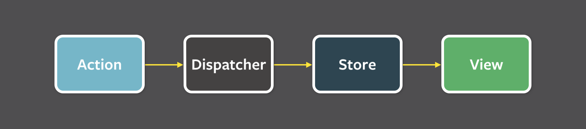

> ⚠️ 해당 글의 내용과 예시 코드, 이미지는 모두 참고 자료에서 가져 와 정리 한 것입니다.

요즘 리액트로 구성 된 대부분의 서비스들은 상태 관리 라이브러리와 함께 사용되고 있습니다.

오늘은 리액트에서 사용된 상태 관리 라이브러리중 아직까지 가장 대표적이고 많이 사용되고 있는 Redux 에 대해 알아보도록 하겠습니다.

그 전에 상태 관리 라이브러리가 무엇인지 부터 알아보도록 하겠습니다.

# 상태 관리 라이브러리
---
- 리액트는 기본적으로 state 와 prop 을 이용해 top-down 방식으로 데이터를 관리합니다.
- 이는 간단한 프로젝트에선 문제가 없었지만 프로젝트가 거대해질수록 다수의 컴포넌트에서 공통으로 사용되야 하는 데이터를 관리하는데에 문제가 생깁니다.
- 이를 위해 React 에서 공식적으로 지원하는 Context API 기능이 있지만 이 또한 데이터마다 Context 를 만들고 Provider 를 제공해야하며 사용해야 할 데이터가 많으면 아래 둘중 하나의 상황이 펼쳐집니다.
    1. 모든 전역상태를 하나의 Context 로 관리할 시 단 하나의 상태만 변경되더라도 해당 Context 를 사용하는 모든 컴포넌트가 재렌더링을 하게 된다는 문제점이 생깁니다.
    2. 또한 이를 피하기 위해 데이터마다 Context 를 따로 생성 할 시 데이터를 추가할때마다 계속해서 Provider 를 중첩해서 공급해줘야 하고 또한 컴포넌트 트리에 너무 많은 Provider 가 생겨난다는 문제점이 생깁니다.
- 위 같은 문제를 보완하기 위해 페이스북은 2014년 Flux 라는 아키텍쳐를 발표했으며 2015년 Flux 아키텍쳐를 만족하면서도 이해하기 쉬운 Redux 라는 라이브러리가 공개되며 큰 인기를 끌게 되었습니다.
- 또한 비슷한 시기 Flux 와 비슷하지만 다른 방식으로 동작하는 Mobx 라는 라이브러리도 함께 등장하였고 Redux 만큼은 아니지만 이 또한 큰 인기를 끌며 Redux 와 Mobx 두가지가 오랜 시간동안 가장 대표적인 리액트 상태 관리 라이브러리로 널리 사용되었습니다. (Mobx 에 대해서는 추후에 자세히 알아보도록 하겠습니다)
- 그리고 지난 2020년 5월 페이스북은 React EU 에서 Recoil 이라는 새로운 상태 관리 라이브러리를 공개하였습니다. (Recoil 에 대해서는 추후에 자세히 알아보도록 하겠습니다)

# Flux 아키텍쳐
---
- React 는 그 당시 일반적이었던 MVC Framework 가 아닌 철저히 View 에만 집중한 라이브러리였습니다.
    
- 따라서 리액트를 보완 해줄 데이터 관리 방법이 필요했는데 리액트측에서는 MVC 모델은 큰 애플리케이션일 수록 관리가 어렵고 확장이 어렵다고 판단하였습니다.
    
    - MVC 패턴은 아래의 이미지처럼 어떤 Action 이 일어나면 Controller 는 Model 의 데이터를 조회하거나 업데이트 하며 이에 대한 변화가 View 에 반영되는 구조로 또한 View 에서 직접 Model의 데이터에도 접근 할 수 있는 패턴입니다. (양방향 데이터 흐름)
        
        
        
    - 이러한 방식은 설계가 간단하고 코드 작성이 쉽다는 장점이 있지만 애플리케이션이 커질수록 Model 과 View 수는 기하급수적으로 늘어나며 금방 서로 복잡하게 얽혀버려 데이터 흐름을 파악하기도 유지보수를 하기도 어려워진다는 문제점이 발생합니다.
        
        
        
- 그래서 리액트는 이에 대한 대안으로 "좀더 예측 가능하도록 코드 구조화" 라는 목적으로 "데이터 흐름이 단방향인 시스템 아키텍쳐" 인 Flux 아키텍쳐를 발표합니다.
    
- Flux 아키텍쳐의 구조는 아래와 같습니다
    



- 이는 View 가 Store 에서 데이터를 전달받아 사용하지만 Store 의 데이터를 직접 변경 할 수 없도록 하여 데이터가 단방향으로 흐르도록 하였습니다.
- 또한 액션이 발생할 경우 모든 데이터는 중앙 허브인 dispatcher 를 통해 흐르게 하였고, 모든 action 은 store 가 dispatcher 에게 등록해둔 callback 을 통해 모든 store 에게 전달되어 store 가 스스로 갱신을 한 다음 자신이 변경되었다고 모두에게 알리는 방식입니다.


- Flux 에 대한 더욱 자세한 내용은 아래 아티클에서 확인하시길 바랍니다.
    - [(번역) Flux로의 카툰 안내서](https://bestalign.github.io/2015/10/06/cartoon-guide-to-flux/)
    - [Flux | 사용자 인터페이스를 만들기 위한 어플리케이션 아키텍쳐](https://haruair.github.io/flux/docs/overview.html)

# Redux 개요

---

- Dan Abramov 라는 개발자는 Flux 를 사용하면서 핫 리로딩(hot reloading)과 시간 여행 디버깅(time travel debugging)기능을 사용하기를 원했지만 Flux 로 처리하기에는 몇가지 문제점이 있었습니다.
    1. 스토어의 코드는 애플리케이션 상태를 삭제하지 않고는 리로딩(reloading)이 불가능하다.
    2. 애플리케이션 상태는 매 액션마다 재기록된다.
    3. 서드파티 플러그인(third-party plugin)이 들어갈 좋은 장소가 없다.
- 2015년 그는 위 문제를 해결하기 위해 Flux 구조에 Reducer 를 결합 한 Redux 를 공개했습니다.
    - Redux = (Red)ucer + Fl(ux)
- 리덕스는 아래 세가지 원칙을 가지고 있습니다.
    1. Single source of truth (진실은 하나의 소스로부터)
        - The state of your whole application is stored in an object tree within a single store. (애플리케이션의 모든 상태는 하나의 스토어 안에 하나의 객체 트리 구조로 저장된다.)
            - 리액트에서는 부모 컴포넌트가 자식 컴포넌트에게 데이터(상태)를 넘겨 줄 수는 있지만 이 데이터의 원천은 항상 스토어가 되어야 합니다.
    2. State is read-only (상태는 읽기 전용이다)
        - The only way to change the state is to emit an action, an object describing what happened. (상태를 변화시키는 유일한 방법은 무슨 일이 벌어지는 지를 묘사하는 액션 객체를 전달하는 방법뿐이다.)
            - View 는 이벤트가 일어났을 경우 액션을 리듀서로 전달 할 뿐, 직접 데이터(상태)를 변경 할 수는 없습니다.
            - 데이터의 변경은 Reducer 만이 가능하며, Reducer 이외의 공간에서는 데이터(상태)는 읽기 모드입니다.
    3. Changes are made with pure functions (변화는 순수 함수로 작성되어야한다)
        - To specify how the state tree is transformed by actions, you write pure reducers. (액션에 의해 상태 트리가 어떻게 변화하는 지를 지정하기 위해 프로그래머는 순수 리듀서를 작성해야한다.)
            - 변화를 일으키는 함수인 리듀서는 반드시 순수 함수여야 합니다.
                - 순수 함수란 함수가 실행되는 곳이 어디든, 언제든 절대 외부의 상태를 변경하지 않으며 동일한 입력값에는 항상 동일한 결과값을 반환하는 함수입니다.
            - 이를 위해 리듀서는 반드시 아래 세가지 규칙을 지켜야 합니다.
                1. 리듀서 함수는 이전 상태와, 액션 객체를 파라미터로 받습니다.
                2. 이전의 상태는 절대로 건들이지 않고, 변화를 일으킨 새로운 상태 객체를 만들어서 반환합니다.
                3. 똑같은 파라미터로 호출된 리듀서 함수는 언제나 똑같은 결과값을 반환해야만 합니다.

# Redux 소개
---
- 리덕스에는 아래와 같은 역할들이 있습니다.
- 스토어(Store)
    - 스토어는 애플리케이션 내의 모든 상태를 가지고 있는 역할을 합니다. (상태 트리)
    - Flux 에선 dispatcher 가 수행하던 dispatch 역할도 스토어가 담당합니다.
        - dispatch 는 액션을 발생시키기 위해 액션 생성자 함수를 이용해 액션을 생성하고 리듀서에게 넘기도록 지시하는 일이라고 생각하면 됩니다.
    - 액션이 들어오면 어떤 상태변화가 필요한지에 대한 일은 리듀서에게 위임합니다.
- 액션(Action)
    - 리덕스에서 스토어의 값을 변경하기 위해선 반드시 액션을 이용해야합니다.
    - 액션은 하나의 객체로 이루어 지며 type 값을 반드시 포함해야합니다.
- 액션 생성자(Action Creator)
    - 위에서 이야기한 액션을 생성하는 역할을 하는 함수입니다.
- 리듀서(Reducer)
    - 액션을 받은 스토어가 현재 애플리케이션의 상태와 액션을 리듀서에게 보내면 리듀서는 해당 상태를 복사한 후 해당 복사본을 액션의 타입에 맞춰 상태를 변경하고 스토어에게 전달하는 역할을 합니다.
    - 리듀서는 상태 객체를 직접 변경하는 것이 아니라 반드시 상태 객체의 복사본을 변경 한 후 복사본을 스토어에게 넘겨줍니다.
- 구독(subscribe)
    - 스토어와 뷰를 연결해 스토어의 상태가 변경 될 때 마다 해당 상태를 이용하는 뷰에게 알려줄 수 있도록 구독 역할이 필요합니다.
    - redux 만 사용 할 경우 스토어의 subscribe 기능을 이용해 스토어의 상태가 변경 될 때 마다 특정 함수를 실행 하도록하여 사용 할 수 있습니다.
    - react 와 함께 사용 할 경우 react-redux 라이브러리의 connect 함수나 useSelector Hook 등으로 해당 컴포넌트를 리덕스 상태에 구독 하여 사용 할 수 있습니다.

# Redux 별도 사용 예시
---
- 우선 React 와 별개로 redux 만을 사용하는 방법부터 간단하게 알아보도록 하겠습니다.
- 아래를 따라서 redux 를 이용해 카운터 예제를 만들어봅시다. (스타일 미적용)
- 우선 npm 과 모듈 번들러를 사용해 ES6 문법과 모듈 임포트 기능을 사용 할 수 있는 환경을 만들어주세요.
- 그리고 npm 을 이용해 `redux` 모듈을 설치해주세요.
- counter 화면을 그릴 index.html 파일을 생성하고 아래와 같이 작성해주세요.

```html
<!-- index.html -->

<html>
  <body>
    <p id="count">0</p> <!-- 카운트 값을 출력 할 Element -->
    <button id="increase">+5</button> <!-- 누르면 count 값을 5 증가 시킬 Element -->
    <button id="decrease">-1</button> <!-- 누르면 count 값을 1 감소 시킬 Element -->
		<script src="./index.js" /> <!-- 번들러 설정에 따라 추가하지 않아도 됨 -->
  </body>
</html>
```

- 그리고 카운터 기능 코드를 작성 할 index.js 파일을 생성해주세요.
- 이제 index.js 파일에 리덕스의 역할들을 하나씩 추가해보도록 하겠습니다. (필요한 역할은 아래와 같습니다)
    - 액션 생성자 (액션을 반환)
    - 리듀서
    - 스토어
    - 구독
- 우선 아래와 같이 `redux 모듈`을 임포트 하고 `액션 타입 상수`와 `액션 생성자`를 추가해주세요.

```jsx
// index.js

// redux 모듈 임포트
import { createStore } from 'redux'

// 액션 타입을 정의 한 상수
const INCREASE = 'counter/INCREASE'
const DECREASE = 'counter/DECREASE'

// 액션 생성자
const increase = num => ({ type: INCREASE, num })
const decrease = num => ({ type: DECREASE, num })
```

- 그리고 아래와 같이 `리듀서` 와 `스토어` 를 추가해주세요.

```jsx
// index.js

// ...

// 스토어의 기본 상태 값
const initialState = {
  count: 0,
}

// 리듀서
const reducer = (value = initialState, action) => {
	// 액션 타입에 따라 새로운 상태 객체를 반환
  switch(action.type) {
    case INCREASE:
			// 반드시 기존 상태 객체를 수정하는 것이 아닌 새로운 객체를 반환하여야 함.
      return {...value, count: value.count + action.num}
    case DECREASE:
			// 반드시 기존 상태 객체를 수정하는 것이 아닌 새로운 객체를 반환하여야 함.
      return {...value, count: value.count - action.num}
    default:
			// 정의 되지 않은 액션 타입일 경우 기존 객체를 그대로 반환
      return value
  }
}

// 위 리듀서를 사용하는 스토어 생성
const store = createStore(reducer)
```

- 그리고 이제 `DOM 객체`에 접근 해 `사용자 이벤트`를 등록하고 이벤트에 맞는 `액션`을 `dispatch` 를 이용해 스토어에게 알려 리듀서에게 전달하도록 해주세요.

```jsx
// index.js

// ...

// DOM 객체 접근
const increaseDom = document.getElementById('increase')
const decreaseDom = document.getElementById('decrease')

// 이벤트를 등록하고 이벤트에 맞춰 dispatch 로 원하는 액션을 스토어에 전달
increaseDom.onclick = () => {
  store.dispatch(increase(5))
}
decreaseDom.onclick = () => {
  store.dispatch(decrease(1))
}
```

- 마지막으로 스토어의 상태 값이 변경 될 시 rendering 이 일어나도록 구독하여 rendering 에서 count 값에 따라 화면이 갱신 되도록 해주세요.

```jsx
// index.js

// ...

// DOM 객체 접근
const countDom = document.getElementById('count')

// 스토어의 상태 값이 변경 될 때 마다 화면을 갱신해줄 렌더링 함수
const rendering = () => {
  const state = store.getState()
  const { count } = state
  countDom.innerHTML = count
}

// 스토어의 상태 값을 구독하여 상태 값이 변경 될 때마다 실행시킬 함수를 스토어에 전달
store.subscribe(rendering)
```

- 위 내용을 종합한 index.js 의 전체 코드는 아래와 같습니다.

```jsx
// index.js

// redux 모듈 임포트
import { createStore } from 'redux'

// 액션 타입을 정의 한 상수
const INCREASE = 'counter/INCREASE'
const DECREASE = 'counter/DECREASE'

// 액션 생성자
const increase = num => ({ type: INCREASE, num })
const decrease = num => ({ type: DECREASE, num })

// 스토어의 기본 상태 값
const initialState = {
  count: 0,
}

// 리듀서
const reducer = (value = initialState, action) => {
	// 액션 타입에 따라 새로운 상태 객체를 반환
  switch(action.type) {
    case INCREASE:
			// 반드시 기존 상태 객체를 수정하는 것이 아닌 새로운 객체를 반환하여야 함.
      return {...value, count: value.count + action.num}
    case DECREASE:
			// 반드시 기존 상태 객체를 수정하는 것이 아닌 새로운 객체를 반환하여야 함.
      return {...value, count: value.count - action.num}
    default:
			// 정의 되지 않은 액션 타입일 경우 기존 객체를 그대로 반환
      return value
  }
}

// 위 리듀서를 사용하는 스토어 생성
const store = createStore(reducer)

// DOM 객체 접근
const increaseDom = document.getElementById('increase')
const decreaseDom = document.getElementById('decrease')

// 이벤트를 등록하고 이벤트에 맞춰 dispatch 로 원하는 액션을 스토어에 전달
increaseDom.onclick = () => {
  store.dispatch(increase(5))
}
decreaseDom.onclick = () => {
  store.dispatch(decrease(1))
}

// DOM 객체 접근
const countDom = document.getElementById('count')

// 스토어의 상태 값이 변경 될 때 마다 화면을 갱신해줄 렌더링 함수
const rendering = () => {
  const state = store.getState()
  const { count } = state
  countDom.innerHTML = count
}

// 스토어의 상태 값을 구독하여 상태 값이 변경 될 때마다 실행시킬 함수를 스토어에 전달
store.subscribe(rendering)
```

- 이제 위 코드를 구동시키면 카운터가 동작하는 것을 확인하실 수 있습니다.

# React + Redux 사용 예시
---
- 위에서 알아본 내용으로 리덕스의 기본적인 구조에 대해 조금은 이해가 되셨을겁니다.
- 이번엔 React 와 함께 Redux 를 사용해 투두리스트 예제를 만들어보도록 하겠습니다.
- 그 전에 리액트와 리덕스를 함께 이용 할 때 알아두시면 좋은 패턴이 있어 먼저 알아보도록 하겠습니다.
    - 바로 컴포넌트를 `컨테이너 컴포넌트`와 `프레젠테이셔널 컴포넌트`로 나눠 사용하는 패턴입니다.
        - 컨테이너 컴포넌트(Container Component)
            - 컨테이너 컴포넌트는 스토어와 직접 연결되어 스토어의 상태 값을 직접 전달받고 스토어에게 액션을 전달하는 역할을 하는 컴포넌트입니다.
            - 컨테이너 컴포넌트는 자신의 DOM 이나 Style 을 가지지 않고 DOM 요소를 그려줄 프레젠테이셔널 컴포넌트에게 각자 필요한 상태 값과 필요한 콜백 함수를 props 로 전달해 프레젠테이셔널은 오로지 사용만 할 수 있도록 합니다.
            - 직접적인 로직이 포함되기 때문에 재사용이 어려운 컴포넌트라고 볼 수 있습니다.
        - 프레젠테이셔널 컴포넌트(Presentaional Component)
            - 프레젠테이셔널 컴포넌트는 직접적으로 DOM 요소를 그리는 컴포넌트로 필요한 스토어의 상태값은 모두 상위 컨테이너 컴포넌트에게 props 로 전달받아 사용하는 컴포넌트입니다.
            - 이벤트에 따라 전달해야하는 액션도 모두 컨테이너 컴포넌트에게 props 로 전달받아 받은 함수를 콜백으로써 단순히 호출만 가능합니다.
            - 동일한 props 만 전달 받을 수 있다면 어디서나 사용이 가능하기 때문에 재사용이 가능한 컴포넌트라고 볼 수 있습니다.
    - 하지만 위 패턴을 반드시 이용해야 하는것은 아닙니다. (아래 예제 코드에선 위 패턴을 사용했습니다.)
- 우선 npm 과 모듈 번들러를 통해 `React` 를 사용 할 수 있는 환경을 만들어주세요.
- 그리고 npm 을 이용해 `redux` 모듈과 `react-redux` 모듈 두개를 설치해주세요.
- Redux 별도 예제와 달리 이번엔 모듈을 분리해서 예제를 작성해보도록 하겠습니다.
- 우선 리덕스 코드들을 관리 할 리덕스 모듈부터 작성하도록 하겠습니다.
    - 리덕스 모듈을 분리하는 방법으론 Action 과 Reducer 를 각각 분리하는 방법이 있고 각 Reducer 마다 필요한 Action 들은 한 파일에 함께 작성하는 방법이 있습니다.
    - 각 Reducer 마다 필요한 Action 들을 한 파일에 작성하는 방식을 [Ducks 패턴](https://github.com/erikras/ducks-modular-redux)이라고 합니다. (이번 예제에선 Ducks 패턴을 사용했습니다.)
- reducers 라는 폴더를 만들고 그 안에 todo.js 파일을 생성한 후 `리듀서`와 `액션 생성 함수`를 추가해주세요.

```jsx
// reducers/todo.js

// 액션 타입 상수
const ADD_TODO = 'todo/ADD_TODO'
const REMOVE_TODO = 'todo/REMOVE_TODO'

// 각 투두마다 고유한 id 가 필요한데 리듀서는 순수함수여야 하기 때문에 리듀서에서 아이디를 생성하거나 변경하면 안 됨.
// 이를 해결하기 위한 방법으로 id 를 액션 생성자 함수에서 결정해서 리듀서에 넘겨주는 방법이 있음.
let id = 0

// 액션 생성자 함수
export const addTodo = todo => ({
  type: ADD_TODO,
  id: ++id,
  todo
})
export const removeTodo = id => ({
  type: REMOVE_TODO,
  id: id
})

// 스토어의 기본 상태 값
const initialState = {
  todos: [
		{ id: 0, content: 'Redux 공부' }
	]
}

// 리듀서
export default function todo(state = initialState, action) {
  switch(action.type) {
    case ADD_TODO:
      return {...state, todos: [...state.todos, { todo: action.todo, id: action.id }]}
    case REMOVE_TODO:
      return {...state, todos: state.todos.filter(todo => todo.id !== action.id)}
    default:
      return state
  }
}
```

- 위 같이 기능별로 분류한 리듀서를 서브 리듀서라고 합니다.
- 위에 작성한 서브 리듀서를 루트 리듀서로 합쳐주는 코드를 reducers/index.js 파일에 작성합니다.

```jsx
// reducers/index.js

import { combineReducers } from "redux";

import todo from './todo'

export default combineReducers({
  todo
})
```

- 그리고 최상위 React Element 를 직접적으로 DOM Element 내에 삽입시켜주는 코드가 있는 index.js 내에서 스토어를 생성하고 react-redux 모듈의 Provider 로 최상위 컴포넌트를 감싸 내부의 모든 컴포넌트에서 리덕스 스토어에 접근 할 수 있도록 해줍니다.

```jsx
// index.js

import React from 'react'
import ReactDOM from 'react-dom'
import { createStore } from 'redux'
import { Provider } from 'react-redux'

import rootReducer from './src/store/modules'

import App from './src/App'

// rootReducer 를 사용 할 스토어를 생성
const store = createStore(rootReducer)

// Provider 로 최상위 컴포넌트인 App 컴포넌트를 감싸 내부 컴포넌트에서 특정 store 가 사용 가능하도록 함
ReactDOM.render(
  <Provider store={store}><App /></Provider>,
  document.getElementById('app')
)
```

```jsx
// App.js

import React, { Fragment } from 'react'

import TodoContainer from './containers/TodoContainer'

const App = () => <TodoContainer />

export default App
```

- 이제 containers 폴더를 만들고 위에서 만든 store 값을 사용 할 컨테이너 컴포넌트를 TodoContainers.js 로 만들어주세요.

```jsx
// containers/TodoContainers.js

import React, { Component } from 'react'
import { connect } from 'react-redux'

import { addTodo, removeTodo } from '../store/modules/todo'

import TodoList from '../components/TodoList'

class TodoContainer extends Component {
  render() {
		// 아래에서 HOC 방식으로 props 에 주입 한 리덕스 상태 값과 액션 디스패치 콜백 함수
    const { todos, addTodo, removeTodo } = this.props
    return (
			// 스토어에서 가져온 상태 값과 함수를 프레젠테이셔널 컴포넌트에 props 로 전달
      <TodoList todos={todos} addTodo={addTodo} removeTodo={removeTodo} />
    )
  }
}

// 리덕스 스토어의 상태 값중 컴포넌트에서 사용 할 상태 값 정의
const mapStateToProps = state => ({
  todos: state.todo.todos
})

// 컴포넌트에서 사용 할 액션을 디스패치 하는 콜백 함수 정의
const mapDispatchToProps = dispatch => ({
  addTodo: todo => dispatch(addTodo(todo)),
  removeTodo: id => dispatch(removeTodo(id))
})

// 위에서 정의 한 상태 값과 함수를 props 로 사용 가능하게 컴포넌트에 HOC 방식으로 주입
export default connect(
  mapStateToProps,
  mapDispatchToProps
)(TodoContainer)
```

- 컨테이너 컴포넌트를 함수형 컴포넌트가 아닌 클래스형 컴포넌트로 만들었습니다.
    - React Hook 이 등장하기 전까지는 데이터를 다루는 컨테이너 컴포넌트는 클래스형 컴포넌트로 만드는것이 일반적이었습니다.
- store 를 리액트 컴포넌트에서 사용하기 위해선 기본적으로 react-redux 모듈의 connect 함수를 이용해서 HOC 방식으로 스토어의 값과 액션을 디스패치 하는 콜백 함수를 props 로 받아오는 방식이 필요합니다.
    - React Hook 을 이용하면 HOC 방식을 이용하지 않고 스토어의 상태 값과 dispatch 콜백 함수를 사용 할 수 있습니다. (이는 아래에서 알아보도록 하겠습니다.)
- 그리고 HOC 방식으로 주입 받은 상태 값과 dispatch 콜백 함수를 프레젠테이셔널 컴포넌트에게 props 로 전달했습니다.
- 이제 components 폴더를 만들고 TodoList.js 라는 이름의 프레젠테이셔널 컴포넌트를 작성해 보도록 하겠습니다.

```jsx
// components/TodoList.js

import React, { Fragment, useState } from 'react'

const TodoList = ({todos, addTodo, removeTodo}) => {
  return (
    <Fragment>
      <InputTodo addTodo={addTodo} />
      <ul>
      {
        todos.map(todo => (
          <Todo key={todo.id} todo={todo} removeTodo={removeTodo} />
        ))
      }
      </ul>
    </Fragment>
  )
}

const InputTodo = ({addTodo}) => {
  const [text, setText] = useState('')
  return (
    <div>
      <input value={text} onChange={(e) => { setText(e.target.value)} }/>
      <button onClick={() => { addTodo(text) }}>추가</button>
    </div>
  )
}

const Todo = ({todo: {content, id}, removeTodo}) => (
  <li>
    {content}
    <button onClick={() => removeTodo(id)}>제거</button>
  </li>
)

export default TodoList
```

- 위 처럼 프레젠테이셔널 컴포넌트까지 작성을 해주고 props 로 전달받은 값들을 사용하도록 해주면 투두 예제가 작동하는 것을 확인하실 수 있습니다.
- 여기에 추가로 React Hook 을 이용해서 HOC 없이 컨테이너 컴포넌트를 작성하는 방법을 위 프로젝트에 카운터 코드를 추가하면서 알아보도록 하겠습니다.
- 우선 카운터에 사용 할 리덕스 모듈을 아래와 같이 생성하고 루트 리듀서에 카운터 서브 리듀서를 추가해주세요.

```jsx
// reducers/counter.js

const INCREASE = 'counter/INCREASE'
const DECREASE = 'counter/DECREASE'

export const increase = count => ({
  type: INCREASE,
  count: count
})
export const decrease = count => ({
  type: DECREASE,
  count: count
})

const initialState = {
  count: 0
}

export default function counter(state = initialState, action) {
  switch(action.type) {
    case INCREASE:
      return {...state, count: state.count + action.count}
    case DECREASE:
      return {...state, count: state.count - action.count}
    default:
      return state
  }
}
```

```jsx
// reducers/index.js

import { combineReducers } from "redux";

import todo from './todo'
import counter from './counter'

export default combineReducers({
  todo,
	counter
})
```

- 이미 루트 리듀서를 이용해 스토어를 만드는 코드는 모두 작성이 되어있으니 바로 컨테이너 컴포넌트를 작성하면 됩니다. containers 폴더 안에 CounterContainer.js 파일을 만들어 아래와 같이 작성해주세요.

```jsx
// containers/CounterContainer.js

import React from 'react'
import { useDispatch, useSelector } from 'react-redux'

import { decrease, increase } from '../store/modules/counter'

import Counter from '../components/Counter'

const CounterContainer = () => {
	// 스토어의 상태 값중 사용 할 상태 값을 추출하고 액션이 디스패치 될 시 다시 selector 를 실행 할 수 있도록 스토어를 구독
  const { count } = useSelector(state => ({
    count: state.counter.count
  }))
	// dispatch 함수 자체를 받아와 직접 dispatch 에 액션을 넘기는 콜백 함수를 작성
  const dispatch = useDispatch()
  const onIncrease = count => dispatch(increase(count))
  const onDecrease = count => dispatch(decrease(count))

  return <Counter count={count} onIncrease={onIncrease} onDecrease={onDecrease} />
}

export default CounterContainer
```

- react-reudx 모듈이 제공하는 useSelector, useDispatch Hook 함수를 이용하여 스토어의 상태 값과 스토어의 dispatch 함수를 사용 하도록 가져 올 수 있습니다.
- useSelector 함수는 위에서 이야기한 connect 함수의 mapStateToProps 인자와 비슷한 역할을 하지만 몇가지 다른점이 있습니다.
    - 리턴값으로 객체가 아닌 값도 넘길 수 있기에 아래 처럼도 사용이 가능합니다.
        
        ```jsx
        const count = useSelector(state => state.counter.count)
        ```
        
    - 또한 액션이 디스패치 되면 이전 결과와 얕은 비교를 진행해 다를 경우 무조건 리렌더링을 진행합니다. (기본적으로 === 비교)
        
        - 이 때문에 useSelector 가 객체를 반환하는 경우 항상 새로운 객체를 반환하기 때문에 객체 값이 변하지 않더라도 리렌더링이 진행 돼 성능에 악영향을 미칠 수 있습니다.
        - 위 문제를 해결하기 위해 아래와 같은 방법을 사용해 개선이 가능합니다.
            - 단일 필드를 리턴하는 useSelector를 여러번 사용한다.
            - Reselect, 또는 복수의 값을 하나의 객체로 리턴해주는 memoized selector 라이브러리를 사용
            - useSelector 의 두번째 인자로 비교 함수를 전달 해 비교하도록 한다. (react-redux 에서 제공하는 shallowEqual 함수를 이용해도 됨)
- useDispatch 함수는 직접 dispatch 함수를 불러와 원하는 액션을 스토어에 디스패치 하는 콜백 함수를 만들 수 있도록 제공해줍니다.
- 이렇게 컨테이너 컴포넌트를 작성 한 후 아래처럼 프레젠테이셔널 컴포넌트까지 작성해주면 카운터 예제도 완성입니다.

```jsx
// components/Counter.js

import React from 'react'

const Counter = ({count, increase, decrease}) => {
  return (
    <div>
      <span>{count}</span>
      <button onClick={() => increase(1)}>+1</button>
      <button onClick={() => decrease(1)}>-1</button>
    </div>
  )
}

export default Counter
```

# Redux Middleware
---
- 리덕스에는 미들웨어를 추가 할 수 있는 기능이 있습니다.
    
- 미들웨어는 액션이 디스패치되어 리듀서로 넘어가는 중간에 함수를 실행시켜 추가적인 작업을 할 수 있는 기능입니다.
    
    
    
- 미들웨어 기능을 사용해 아래와 같은 각종 작업들을 진행 할 수 있습니다.
    
    - 특정 조건에 따라 액션이 무시되게 만들 수 있습니다.
    - 액션을 콘솔에 출력하거나, 서버쪽에 로깅을 할 수 있습니다.
    - 액션이 디스패치 됐을 때 이를 수정해서 리듀서에게 전달되도록 할 수 있습니다.
    - 특정 액션이 발생했을 때 이에 기반하여 다른 액션이 발생되도록 할 수 있습니다.
    - 특정 액션이 발생했을 때 특정 자바스크립트 함수를 실행시킬 수 있습니다.
- 리덕스에서 미들웨어가 가장 많이 사용되는 부분은 비동기 작업 처리 부분입니다.
    
- 미들웨어는 누구든지 만들어 사용이 가능하지만 일반적으로는 미들웨어 모듈을 설치해 사용합니다.
    
- 리덕스 미들웨어 모듈중 가장 많이 사용되는 라이브러리는 redux-thunk 와 redux-saga 로 비동기작업을 처리 할 수 있습니다.
    

# 미들웨어 직접 만들기
---
- 미들웨어는 아래와 같은 [템플릿](https://redux.js.org/tutorials/fundamentals/part-4-store#middleware)을 사용하는 하나의 함수입니다.

```jsx
const middleware = store => next => action => {
  // 하고 싶은 작업...
}

// 위와 동일
function middleware(store) {
  return function (next) {
    return function (action) {
      // 하고 싶은 작업...
    };
  };
};
```

- 첫번째 store 인자는 스토어의 인스턴스로 store 의 dispatch, getState, subscribe 등의 기능을 사용 할 수 있게 해줍니다.
- 두번째 next 인자는 현재 액션을 다음 미들웨어로 넘기는 함수로 `next(action)` 형태로 사용됩니다. (다음 미들웨어가 없다면 리듀서에게 전달됩니다.)
- 세번째 action 인자는 현재 처리되고 있는 액션 객체입니다.
- 아래는 디스패치 된 액션을 출력하는 미들웨어 예시 코드입니다.

```jsx
const myLogger = store => next => action => {
  console.log(action); // 먼저 액션을 출력합니다.
  const result = next(action); // 다음 미들웨어 (또는 리듀서) 에게 액션을 전달합니다.
  return result; // 여기서 반환하는 값은 dispatch(action)의 결과물이 됩니다. 기본: undefined
};

export default myLogger;
```

- 그리고 미들웨어를 적용하기 위해선 아래와 같이 스토어를 생성하는 createStore 함수의 두번째 인자로 applyMiddleware 함수에 원하는 미들웨어를 인자로 담아 전달해주면 됩니다.

```jsx
// ...

import { createStore, applyMiddleware } from 'redux';
import myLogger from './middlewares/myLogger';

const store = createStore(rootReducer, applyMiddleware(myLogger));

// ...
```

- 또한 위에서 이야기 했듯이 미들웨어에서 리듀서로 전달 될 액션을 수정하여 전달도 가능하기 때문에 아래와 같이 미들웨어를 이용해 디스패치에 액션 타입을 객체가 아닌 함수를 받도록 하여 미들웨어에서 해당 함수를 실행 시키도록 할 수도 있습니다.

```jsx
const thunk = store => next => action =>
  typeof action === 'function'
    ? action(store.dispatch, store.getState)
    : next(action)
```

- 위 함수는 디스패치에 함수가 넘어 올 경우 함수를 실행시키고 next(action) 을 하지 않기 때문에 리듀서로 디스패치가 넘어가지 않습니다.
- thunk 는 함수 내에서 처리 이후 새로운 dispatch 를 넘기는 방법으로 사용됩니다.
- thunk 미들웨어를 등록하면 아래와 같이 디스패치에 함수를 넘길 수 있습니다. (함수가 두개의 새로운 디스패치를 리듀서에 전달)

```jsx
const myThunk = () => (dispatch, getState) => {
  dispatch({ type: 'HELLO' });
  dispatch({ type: 'BYE' });
}

dispatch(myThunk());
```

- 위와 유사한 방법으로 만들어둔 미들웨어 모듈이 redux-thunk 입니다.
- redux-thunk 미들웨어를 이용하여 아래와 같이 디스패치 함수를 만들어 비동기 처리를 할 수 있습니다.

```jsx
// 액션 생성자 함수의 역할까지 함께 수행
export const getPosts = () => async dispatch => {
  dispatch({ type: GET_POSTS }); // 요청이 시작됨
  try {
    const posts = await postsAPI.getPosts(); // API 호출
    dispatch({ type: GET_POSTS_SUCCESS, posts }); // 성공
  } catch (e) {
    dispatch({ type: GET_POSTS_ERROR, error: e }); // 실패
  }
};
```

- 요즘 가장 핫한 redux middleware 는 redux-saga 입니다.
- redux-saga 는 다양한 기능을 제공하는 만큼 사용법이 조금 복잡하여 다음 글에서 따로 살펴보도록 하겠습니다.

## 이후 작성 할 내용
---
1. [redux-saga](/redux-saga)
2. Recoil
3. Mobx

## 참고 자료
---
- [리덕스(Redux)는 왜 쓰는 건데!?](https://velog.io/@wooder2050/%EB%A6%AC%EB%8D%95%EC%8A%A4Redux%EB%8A%94-%EC%99%9C-%EC%93%B0%EB%8A%94-%EA%B1%B4%EB%8D%B0)
- [(번역) Redux로의 카툰 안내서](https://bestalign.github.io/2015/10/26/cartoon-intro-to-redux/)
- [6장. 리덕스](https://react.vlpt.us/redux/)