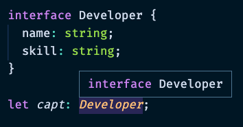

> ⚠️ 해당 글의 내용과 예시 코드, 이미지는 모두 참고 자료에서 가져 와 정리 한 것입니다.

# 타입스크립트란?
---
- 타입스크립트란 자바스크립트에 타입을 부여 한 언어입니다.
- 타입스크립트는 브라우저에서 실행하기 위해 자바스크립트로 변환해주는 컴파일 과정이 필요합니다. (tsc 명령어를 이용하거나 모듈 번들러, 자동화 도구 등을 이용하여 컴파일 할 수 있습니다.)

# 타입스크립트를 사용해야 하는 이유
---
- 타입 명시를 통해 런타임 이전에 발생 할 수 있는 휴면 에러를 사전에 미리 방지 할 수 있습니다.
- 또한 타입 명시를 통해 개발 툴과 함께 자바스크립트보다 강력한 자동 완성 기능을 지원하여 개발에 도움을 줄 수 있습니다.

# 변수 타입 표기
---
- 타입스크립트는 아래와 같은 방법으로 변수에 타입을 명시합니다. 이를 타입 표기(Type Annotation) 이라고 합니다.

```tsx
let str: string = 'hi'
```

- 타입스크립트에는 크게 아래 12가지 타입이 있습니다.
    - Boolean
        
    - Number
        
    - String
        
    - Object
        
        - 해당 변수는 객체라고 정의 할 때 사용합니다.
    - Array
        
        ```tsx
        let arr: number[] = [1,2,3];
        let arr: Array<number> = [1,2,3]; // generic
        ```
        
    - Tuple
        
        - 튜플은 배열의 길이가 고정되고 각 요소의 타입이 지정되어 있는 배열 형식을 의미합니다.
        
        ```tsx
        let arr: [string, number] = ['hi', 10];
        
        arr[1].concat('!'); // Error, 'number' does not have 'concat'
        arr[5] = 'hello'; // Error, Property '5' does not exist on type '[string, number]'.
        ```
        
    - Enum
        
        - 이넘은 특정 상수들의 집합을 의미합니다.
        - 숫자형과 문자형으로 정의가 가능합니다.
        
        ```tsx
        // 숫자형
        enum Shoes {
          Nike = 10,
          Adidas
        }
        
        const nike = Shoes.Nike // 10
        const adidas = Shoes.Adidas // 11
        
        // 문자형
        enum Shoes2 {
          Nike = 'Nike',
          Adidas = 'Adidas'
        }
        
        const nike2 = Shoes2.Nike // 'Nike'
        const adidas2 = Shoes2.Adidas // 'Adidas'
        ```
        
    - Any
        
        - 모든 타입이 들어와도 허용한다는 의미입니다.
    - Void
        
        - 변수에 할당 할 시 undefined or null 만 할당 될 수 있다는 의미입니다.
        - 함수 반환값으로 할당 할 시 반환 값을 설정할 수 없는 함수라는 의미입니다.
        
        ```tsx
        let unuseful: void = undefined;
        
        function notuse(): void {
          console.log('sth');
        }
        ```
        
    - Undefined
        
        - 변수에 값이 할당되지 않았음을 의미합니다.
    - Null
        
        - 명시적으로 변수에 값이 없다는 것을 의미합니다.
        - (값이 할당되지 않은것이 아닌 null 이라는 빈 값을 변수에 할당 한 것입니다.)
    - Never
        
        - 변수에 할당 할 경우 이 변수는 아무 값도 할당 할 수 없다는 의미입니다.
        - 함수 반환 값으로 할당 할 경우 이 함수는 절대 함수의 끝에 도달하지 않는다는 의미입니다.

# 함수 타입 표기
---
- 아래와 같은 자바스크립트 함수가 있다고 가정하겠습니다.

```tsx
function sum(a, b) {
  return a + b;
}
```

- 위 함수의 인자에는 변수에 타입을 명시하듯이 아래와 같이 타입을 명시 할 수 있습니다.

```tsx
function sum(a: number, b: number) {
  return a + b;
}
```

- 타입스크립트에서의 함수는 모든 인자 값을 필수 값으로 간주합니다.
- 함수 인자를 모두 넘기지 않아도 되는 자바스크립트의 특징을 사용하고 싶다면 아래와 같이 `?` 를 이용하여 정의 할 수 있습니다.

```tsx
function sum(a: number, b?: number) {
  return a + b;
}
```

- 또한 ES6 에서 지원하는 [Rest 문법](https://developer.mozilla.org/ko/docs/Web/JavaScript/Reference/Functions/rest_parameters)은 아래와 같이 사용 할 수 있습니다.

```tsx
function sum(a: number, ...nums: number[]) {
	return a + nums.reduce((acc, cur) => acc + cur, 0)
}
```

- 여기에 추가로 반환값의 타입은 아래와 같이 명시 할 수 있습니다.

```tsx
function sum(a: number, b: number): number {
  return a + b;
}
```

# 인터페이스
---
- 타입스크립트의 꽃이라고 할 수 있는 인터페이스는 아래와 같은 범주에 대해 약속을 정의 할 수 있습니다.
    - 객체(Object)의 스펙(속성과 속성의 타입)
    - 함수의 파라미터
    - 함수의 스펙(파라미터, 반환 타입 등)
    - 배열과 객체를 접근하는 방식
    - 클래스
- 인터페이스는 기본적으로 아래와 같이 정의합니다.

```tsx
interface 인터페이스_이름 {
  속성: 타입;
}
```

- 또한 `?` 를 사용해 꼭 포함되지 않아도 되는 옵션 속성을 지정 할 수도 있습니다.

```tsx
interface 인터페이스_이름 {
  속성?: 타입;
}
```

- 객체 인터페이스 사용 예시는 아래와 같습니다.

```tsx
interface User {
  name: string;
  age?: number;
}

var seho: User = {
  age: 23,
  name: 'seho'
}

var mina: User = {
	name: 'mina'
}
```

- readonly 속성을 이용해 객체를 처음 생성할 때만 값을 할당하고 그 이후에는 변경 할 수 없는 읽기 전용 속성을 정의 할 수 있습니다.

```tsx
interface CraftBeer {
  readonly brand: string;
}

let myBeer: CraftBeer = {
  brand: 'Belgian Monk'
};

myBeer.brand = 'Korean Carpenter'; // error!
```

- 또한 아래와 같이 인터페이스로 함수 타입을 정의 할 수도 있습니다.

```tsx
interface login {
  (username: string, password: string): boolean;
}

let loginUser: login = function(id: string, pw: string): boolean {
  console.log('로그인 했습니다');
  return true;
}
```

- 또 아래와 같이 클래스의 타입 규칙을 정할수도 있습니다.

```tsx
interface CraftBeer {
  beerName: string;
  nameBeer(beer: string): void;
}

class myBeer implements CraftBeer {
  beerName: string = 'Baby Guinness';

  nameBeer(b: string) {
    this.beerName = b;
  }

  constructor() {}
}
```

- 그리고 인터페이스는 인터페이스간의 확장이 가능합니다.

```tsx
interface Person {
  name: string;
}

interface Developer extends Person {
  skill: string;
}

let seho: Developer = {
	name: 'seho',
	skill: 'TypeScript'
}
```

# 타입 별칭
---
- 타입스크립트에는 인터페이스와 비슷하게 특정 타입이나 인터페이스를 참조 할 수 있는 타입 변수인 타입 별칭 이라는 것이 있습니다.

```tsx
type Developer = {
  name: string;
  skill: string;
}

let seho: Developer = {
	name: 'seho',
	skill: 'TypeScript'
}
```

- 타입 별칭은 인터페이스와 달리 새로운 타입을 생성하는것이 아니라 나중에 쉽게 참고 할 수 있게 타입에 이름을 부여해놓은 것과 같아 VSCode 의 타입 프리뷰에서 아래와 같은 차이가 발생합니다.
    
    - 인터페이스
    

    - 타입 별칭
    
    
- 또한 인터페이스와 타입 별칭의 가장 큰 차이점은 확장 가능 여부입니다. 인터페이스는 확장이 가능하지만 타입 별칭은 확장을 할 수 없습니다.
    
    - [좋은 소프트웨어는 언제나 확장이 용이해야 한다는 원칙](https://en.wikipedia.org/wiki/Open%E2%80%93closed_principle)에 따라 가급적 확장 가능한 인터페이스로 선언하는 것이 좋습니다.

# 제네릭
---
- 제네릭이란 타입을 마치 함수의 파라미터처럼 사용하는 것을 의미합니다.

```tsx
function getText<T>(text: T): T {
  return text;
}

getText<string>('hi');

// 위처럼 함수를 사용 할 시 getText 함수는 아래처럼 정의된 것과 같다.

function getText<string>(text: string): string {
  return text;
}
```

- 제네릭 타입은 다양한 타입 지원을 원하지만 반환 타입에 대한 정의를 명확히 하고 싶을 때 유용하게 사용 할 수 있습니다.

# 유니온, 인터섹션 타입
---
- 연산자를 이용해 타입을 정의하는 유니온 타입과 인터섹션 타입이 있습니다.
- 유니온 타입이란 OR 연산자를 이용하는 타입으로 타입을 여러개 허용하는 방법입니다.

```tsx
function logText(text: string | number) {
  // ...
}
```

- 인터섹션 타입이란 AND 연산자를 이용하는 타입으로 여러 타입을 만족하는 하나의 타입을 정의하는 방법입니다.

```tsx
interface Person {
  name: string;
  age: number;
}

interface Developer {
  name: string;
  skill: number;
}

let Capt: Person & Developer = {
  name: 'Capt',
  age: 100,
  skill: 'Typescript'
};
```

# 제네릭 타입 제한
---
- 아래와 같은 방법으로 제네릭 타입 객체의 내부 속성에 대한 정의를 할 수 있습니다.

```tsx
interface LengthType {
	length: number
}

function foo<T extends LengthType>(t: T): T {
	return t
}

foo('10') //success
foo({length: 1}) //success
foo(10) //fail
```

- 아래와 같은 방법으로 keyof 를 이용해 제네릭 타입을 제한 할 수도 있습니다.

```tsx
interface ShoppingItem {
  name: string;
  price: number;
  stock: number;
}

function getShoppingItemOption<T extends keyof ShoppingItem>(itemOption: T): T {
  return itemOption
}

getShoppingItemOption("name")
getShoppingItemOption<"price">("price")
```

# 딕셔너리 인터페이스 예시
---
- 아래와 같이 객체의 key 와 value 타입까지 지정 할 수 있습니다.

```jsx
interface PhoneNumberDictionary {
  [phone: string]: {
    num: number;
  };
}

let phones: PhoneNumberDictionary = {
	home: {
		num: 11122223333,
	},
	office: {
		num: 44455556666,
	}
}
```

# Promise 반환 타입 예시
---
```jsx
function fetchContacts(): Promise<Contact[]> {
  const contacts: Contact[] = [
		...
  ];
  return new Promise(resolve => {
    setTimeout(() => resolve(contacts), 2000);
  });
}
```

# 타입 단언
---
```jsx
const div = document.querySelector('.div') as HTMLDivElement;
div.innerText = '123'; // const div: HTMLDivElement

const span = document.querySelector('.span')
span!.innerText = '123' // span은 null 이 아니라고 단언 (eslint가 forbidden non-null assertion 에러 냄)
```

- 타입이 틀리거나 값이 비어있을 경우 타입스크립트가 에러를 감지하지 못하므로 런타임 에러가 발생 할 수 있음에 주의해야합니다.

# 타입 가드
---
```jsx
interface Developer {
  name: string;
  skill: string;
}

interface Person {
  name: string;
  age: number;
}

function isDeveloper(target: Developer | Person): target is Developer {
  return (target as Developer).skill !== undefined
}
```

# 타입 호환
---
- 인터페이스, 클래스 타입 호환
- (요구하는 속성을 모두 가지고 있다면 요구하지 않는 속성을 가지고 있더라도 OK)

```jsx
interface Developer2 {
  name: string;
  skill: string;
}

interface Person2 { // class여도 상관 X
  name: string;
}

var developer: Developer2;
var person: Person2;

developer = person //fail
person = developer //success
```

- 함수 타입호환

```jsx
var add2 = function(a: number): number {
  return a+2
}
var sum2 = function(a: number, b:number):number {
  return a+b
}
add2 = sum2 // fail
sum2 = add2 // success
```

- 제네릭 타입호환
- (제네릭 타입이 내부 속성에서 사용되지 않으면 제네릭 타입이 달라도 OK)

```jsx
class Empty<T> {}
var empty1: Empty<number>
var empty2: Empty<string>
empty1 = empty2 // success

class NotEmpty<T> { value:T }
var notEmpty1: NotEmpty<number>
var notEmpty2: NotEmpty<string>
notEmpty1 = notEmpty2 // fail
```

# 유틸리티 타입(제네릭 타입)
---
- 이미 정의해놓은 타입을 조금 변환해서 사용하고 싶을때 유용한 타입입니다.
- Partial (부분집합을 사용하려 할 때)

```jsx
interface Address {
  email: string;
  address: string;
}

type MayHaveEmail = Partial<Address>;
const me: MayHaveEmail = {}; // 가능
const you: MayHaveEmail = { email: 'test@abc.com' }; // 가능
const all: MayHaveEmail = { email: 'capt@hero.com', address: 'Pangyo' }; // 가능
```

- Pick (정의해놓은 타입중 원하는것만 사용하고 싶을 때)

```jsx
interface Hero {
  name: string;
  skill: string;
}
const human: Pick<Hero, 'name'> = {
  name: '스킬이 없는 사람',
}; // type Pick = { name: string; }
```

- Omit (정의해놓은 타입 중 원하는것만 제외하고 사용하고 싶을 때)

```jsx
interface AddressBook {
  name: string;
  phone: number;
  address: string;
  company: string;
}
const phoneBook: Omit<AddressBook, 'address'> = {
  name: '재택근무',
  phone: 12342223333,
  company: '내 방'
}
const chingtao: Omit<AddressBook, 'address'|'company'> = {
  name: '중국집',
  phone: 44455557777
}
```

- 그 외에도 많은 타입이 있습니다.
    - [https://www.typescriptlang.org/docs/handbook/utility-types.html](https://www.typescriptlang.org/docs/handbook/utility-types.html)

# 맵드 타입(Mapped Type)
---
- 기존에 정의되어 있는 타입을 새로운 타입으로 변환해주는 문법입니다.
- 기본 문법 (map 함수를 타입에 적용했다고 보면 됩니다)

```jsx
{ [ P in K ] : T }
{ [ P in K ] ? : T }
{ readonly [ P in K ] : T }
{ readonly [ P in K ] ? : T }
```

# JSDoc
---
- 큰 js 파일같은 경우 한번에 ts 로 옮기려면 힘들 수 있으니 그런 경우 아래와 같이 JSDoc 을 이용하면 js 파일을 ts 파일로 바꾸지 않고도 원하는 부분부터 점진적으로 ts 적용이 가능합니다.

```jsx
// @ts-check
...
/**
 * @typedef {object} CovidSummary
 * @property {Array<object>} Countries
 * @property {String} Date
 * @property {Array<object>} Global
 * @property {String} Message
 */
/**
 * @returns {Promise<CovidSummary>}
 */
function fetchCovidSummary() {
  const url = '<https://api.covid19api.com/summary>';
  return axios.get(url);
}
```

# @types 라이브러리
---
- 자바스크립트로 만들어진 써드파티 라이브러리를 타입스크립트에서 사용하기 위해선 각 기능에 대한 타입이 정의되어 있어야 합니다.
- 예를 들어 아래와 같은 코드는 타입스크립트에서 제대로 작동하지 않습니다.

```tsx
// app.ts
import $ from 'jquery';

$(document).ready();
```

- 그 이유는 제이쿼리 라이브러리 내부 코드에 대한 타입이 정의되어 있지 않기 때문입니다.
- 이런 경우에 Definitely Typed 를 이용해 라이브러리 타입을 정의 해놓은 @types 라이브러리를 설치해서 사용 할 수 있습니다. 예를 들어 제이쿼리의 경우 아래처럼 라이브러리를 설치해서 사용하면 됩니다.

```bash
npm i -D @types/jquery
```

- 아래 링크에서 타입 정의가 되어있는 오픈소스 라이브러리를 검색 할 수 있습니다.
    - [https://www.typescriptlang.org/dt/search/](https://www.typescriptlang.org/dt/search/)
- 만일 @types 라이브러리가 없는 오픈소스 라이브러리의 경우 아래와 같은 방법으로 자체적으로 타입을 정의 할 수 있습니다. (foo 라이브러리라고 가정)

```jsx
// ./tsconfig.json
{
	...
  "compilerOptions": {
    ...
    "typeRoots": ["./node_modules/@types", "./types"]
  },
	...
}
```

```jsx
// ./types/foo/index.d.ts
declare module 'foo' {
	...
};
```

# 옵셔널 체이닝
---
```jsx
const recoveredList = document.querySelector('.recovered-list');

recoveredList?.appendChild(li); // 아래와 유사하게 동작

if(recoveredList === null || recoveredList === undefined)
	return
else
	recoveredList.appendChild(li);
```

# + 유틸 함수에 제네릭 이용하기 예시
---
```jsx
function $<T extends HTMLElement = HTMLDivElement>(selector: string) { // 제네릭 기본 타입 설정 (만일 기본 타입을 설정하지 않고 제네릭 타입도 넘기지 않는다면 HTMLElement로 자동 타입 단언 됨)
  return document.querySelector(selector) as T;
}

const span = $<HTMLSpanElement>('.span'); // const span: HTMLSpanElement
const div = $('div') //const div: HTMLDivElement
```

# 추가로 읽어보면 좋은 타입스크립트 관련 문서
---
- [타입스크립트 공식 문서](https://www.typescriptlang.org/docs/)
- [타입스크립트 Deep Dive](https://basarat.gitbook.io/typescript/)
    - [타입스크립트 Deep Dive (한글 번역)](https://radlohead.gitbook.io/typescript-deep-dive/getting-started)

## 참고 자료
---
- [타입스크립트 입문 - 기초부터 실전까지](https://www.inflearn.com/course/%ED%83%80%EC%9E%85%EC%8A%A4%ED%81%AC%EB%A6%BD%ED%8A%B8-%EC%9E%85%EB%AC%B8)
- [실전 프로젝트로 배우는 타입스크립트](https://www.inflearn.com/course/%ED%83%80%EC%9E%85%EC%8A%A4%ED%81%AC%EB%A6%BD%ED%8A%B8-%EC%8B%A4%EC%A0%84)
- [타입스크립트 핸드북](https://joshua1988.github.io/ts/intro.html)